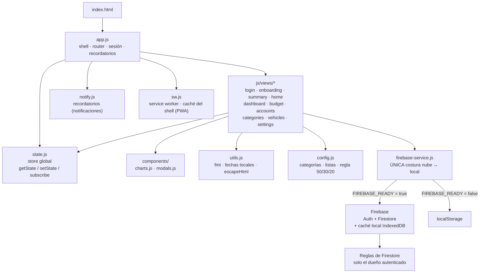
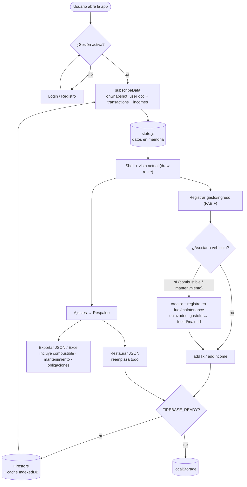

# Finanzas JDCH — PWA

App de finanzas personales: clasificación COICOP, presupuesto editable por mes (valor o %), tableros con comparativo 50/30/20 y canasta DANE, edición de categorías/subcategorías, importación de Excel y nube con usuarios (Firebase). Incluye un **módulo opcional de Vehículos** (combustible, mantenimiento y obligaciones legales como SOAT/tecnomecánica).

## Estado actual y cómo continuar (flujo de trabajo)

**Versión actual: caché v72.** Si retomas el proyecto desde otro equipo o el celular, sigue este flujo para no pisar cambios (una vez se duplicó trabajo por editar en paralelo).

**Arranque rápido en otra sesión (celular u otro PC):**
1. Abre Claude Code (web `claude.ai/code` o la app) con tu cuenta y conecta el repo `jdch1206/FINANZAS-JDCH`.
2. `git pull origin main` (trae lo último — vamos en v70). El desarrollo va directo sobre `main`.
3. Trabaja. Para probar local: `python -m http.server 8000` en la raíz del repo (no hay Node/npm).
4. En **cada cambio de código**: sube el caché del SW (`const CACHE = "finanzas-jdch-vNN"` en `sw.js`, NN+1) y anota el cambio en el changelog de abajo. Saltarse esto es la causa #1 de "mi cambio no se ve".
5. `git commit` + `git push origin main` al terminar (los cambios quedan como commit lineal sobre `main`; ver el changelog para el historial de versiones).

**Reglas fijas:**
- **Nunca** subas `datos/` ni `documentacion/` (datos personales reales; ya en `.gitignore`). Solo `app/` está en GitHub.
- Convenciones: UI en español · dinero en enteros COP · fechas en hora local (nunca `toISOString` para "hoy") · `escapeHtml()` en todo valor del usuario dentro de `innerHTML`.
- Probar en una copia aislada con `FIREBASE_READY = false` antes de desplegar; nunca contra los datos reales de la nube.

Qué hace cada pantalla: ver **Módulos (pantallas)** y **Arquitectura** más abajo. Historial completo: en el changelog.

> **Seguridad:** las claves de `firebase-config.js` son **públicas por diseño** (config de cliente); lo que protege los datos son las **reglas de Firestore** (solo el dueño autenticado lee/escribe lo suyo). Nunca se suben claves privadas (`serviceAccount*.json`, `.env`) — bloqueadas en `.gitignore`.

## Mapa de arquitectura

Cómo se conectan las piezas. Todo corre en el navegador (archivos estáticos); `firebase-service.js` es la única costura que decide, en tiempo de ejecución, si los datos van a la nube (Firebase) o al almacenamiento local.



## Mapa de procesos

Flujos principales: arranque y carga de datos, registro de un movimiento (con la opción de enlazarlo a un vehículo) y respaldo/restauración.



## Novedades (changelog)

La app no usa versión numérica formal; la referencia técnica es la constante `CACHE` del service worker (`sw.js`), hoy **v72**. Cambios por fecha (más reciente primero):

### 2026-08-24 · caché v72 — Vehículos: desglose de gasto + asociar vehículo al editar
- 🚗 En **Vehículos**, la línea "Gasto asociado a este vehículo" ahora es tocable y abre un **desglose** (dona + barras) que separa el gasto en **Combustible · Mantenimiento · Lavado · Obligaciones · Otros**, con conteo por rubro. Responde "¿cuánto llevo en lavadas de la moto?". Combustible/Mantenimiento salen de sus bitácoras (vínculo `fuelId`/`maintId`), Lavado se detecta por la descripción, y el resto va en Otros.
- ✏️ Al **editar un gasto** ya existente ahora aparece el selector **"Asociar a vehículo"** (antes solo salía al crear). Permite etiquetar/cambiar/quitar el vehículo de un gasto. Si el gasto está vinculado a un tanqueo/mantenimiento/obligación, se indica que su vehículo se administra desde ese módulo (para no dejar registros huérfanos).

### 2026-08-24 · caché v71 — Cuentas: gráfica "Así ha crecido tu dinero"
- 📈 Nueva tarjeta en **Cuentas** con la **evolución del saldo** en el tiempo (reconstruida de los movimientos de "Actualizar saldo"), con selector por cuenta o Todas. Debajo muestra **Rendimientos** y **Aportes** acumulados. Aparece cuando hay al menos 2 fechas con movimientos registrados.

### 2026-08-24 · caché v70 — Cuentas: actualizar saldo (rendimiento) + recordatorio semanal
- 📈 Nuevo botón **Actualizar saldo** en cada cuenta: escribes el nuevo total que ves en el banco y la app calcula sola el **rendimiento** (cuánto creció) y separa cualquier **aporte extra** con su nota. Ambos quedan como movimientos de la cuenta (tipo `rendimiento`/`aporte`), sin afectar gastos ni ingresos. Estilo "Así ha crecido tu dinero" de Nu.
- 🔔 **Recordatorio semanal** (sugerido cada viernes): la vista de Cuentas muestra una tarjeta con las cuentas de Ahorro/Inversión/Corriente pendientes de actualizar (≥7 días, o el viernes desde 5 días), con botón directo. Si tienes las notificaciones activadas, también llega el aviso una vez al día, junto con los de vehículos.
- 💹 El total disponible y el detalle por cuenta muestran cuánto llevas registrado en **rendimientos**. Cada fila indica hace cuántos días se actualizó.

### 2026-08-19 · caché v69 — Cuentas: movimientos propios (sumar/restar) con nota
- 💳 Cada cuenta en **Cuentas** tiene ahora un botón **+** para registrar **movimientos propios**: sumar o restar dinero al saldo con una **breve descripción** y fecha. Ajustan solo el saldo de esa cuenta y **no** afectan tus **gastos ni ingresos** (son aparte). Incluye historial por cuenta con opción de eliminar cada movimiento (revierte el saldo), y el conteo de movimientos se muestra bajo el nombre de la cuenta.

### 2026-07-25 · caché v68 — Valor por galón también al abrir el tanqueo
- ⛽ Al abrir (editar) un tanqueo, el resumen superior ahora incluye **Valor por galón** de esa compra (costo ÷ galones), junto al rendimiento, pesos por km y distancia del tramo. Se muestra en todos los tanqueos, incluso los que no cierran un tramo.

### 2026-07-25 · caché v67 — Combustible: valor por galón en cada tanqueo
- ⛽ Cada renglón de la bitácora de Combustible ahora muestra el **valor por galón** de ese tanqueo (costo ÷ galones), ej.: `2.57 gal · $18.483/gal · 43.247 km · …`. Complementa el "Valor prom./galón" del resumen.

### 2026-07-25 · caché v66 — Combustible: valor promedio por galón
- ⛽ Nuevo indicador en el módulo Combustible: **Valor prom./galón** (gasto total ÷ galones totales), junto a "Gasto total" y "Galones total".

### 2026-07-25 · caché v65 — Se retira "Compartir a la app"
- 🗑️ Se removió la función **Compartir (Web Share Target)** (manifest `share_target` + parser de texto): no funcionaba de forma confiable al compartir desde las apps de banco. El registro de gastos sigue siendo manual desde **Movimientos → +**. La captura automática desde notificaciones queda como idea futura (requiere backend).

### 2026-07-25 · caché v64 — Compartir: soporta formato de monto colombiano y comercio de Nu
- 🐞 Corregido el extractor de "Compartir": el monto en formato Colombia (`$37.449,00` = punto miles, coma decimales) se interpretaba 100× más grande. Ahora descarta los decimales `,00` y quita los puntos de miles → **$37.449** correcto.
- 🏪 El comercio se toma de lo que va entre `en` y `por $` (ej. "COMCEL PAGOS DE FACTUR" en notificaciones de Nu). Con respaldos para otros formatos.

### 2026-07-25 · caché v63 — Versión visible en Ajustes
- 🔢 Ajustes ahora muestra al final la **versión activa** (ej. "Finanzas JDCH · versión v63"). Se lee del caché real del service worker, así siempre refleja la versión que de verdad está corriendo — útil para confirmar que una actualización se aplicó.

### 2026-07-25 · caché v62 — Caché local de Firestore (menos lecturas, más rápido)
- ⚡ Se activó la **persistencia local (IndexedDB)** en la conexión con Firestore: tras la primera carga, la app solo descarga lo que cambió → **menos lecturas**, **abre más rápido** y **funciona sin conexión**. La búsqueda sigue cubriendo todo el historial (los datos quedan en el dispositivo). Si el navegador no soporta la caché, cae a la Firestore normal sin romperse.
- 🔒 **Privacidad:** al **cerrar sesión** se borra la caché local (`terminate` + `clearIndexedDbPersistence`), útil en equipos compartidos.
- 📄 README ampliado: sección "Estado actual y cómo continuar" (arranque en otra sesión), **mapa de arquitectura** y **mapa de procesos** (diagramas Mermaid).

### 2026-07-25 · caché v61 — Compartir a la app + fix comparativo por mes
- 📲 **Compartir a Finanzas JDCH**: la app (instalada como PWA) aparece en el menú "Compartir" de Android. Al compartir un texto de pago (ej. "Pagaste $23.500 en D1"), abre **Nuevo gasto** con el **monto y la descripción prellenados** (extrae el número tras "$" y el comercio tras "en"). Tú confirmas categoría y guardas. No necesita permisos especiales ni servidor.
- 🐞 **Tablero – Comparativo de gasto**: ahora **sigue el mes seleccionado** en los chips (antes quedaba fijo en el mes actual). Al elegir un mes, el comparativo, el gráfico año-vs-año y "Categorías: mes vs promedio 12m" se recalculan para ese mes.

### 2026-07-25 · caché v60 — Respaldo completo (incluye vehículos)
- 💾 El **respaldo JSON** y la **exportación a Excel** ahora incluyen **todo**: además de gastos, ingresos, cuentas, categorías, metas y recurrentes, guardan **combustible, mantenimiento y obligaciones** de los vehículos. Antes esas tres subcolecciones quedaban fuera del respaldo.
- ♻️ Al **restaurar** un respaldo se recuperan también esas subcolecciones (en la nube se reemplazan por completo; en local igual). El Excel las exporta en hojas separadas (Combustible, Mantenimiento, Obligaciones) con el nombre del vehículo.

### 2026-07-25 · caché v59 — Combustible: distancia del tramo en la lista
- 📏 Cada tanqueo de la bitácora ahora muestra la **distancia recorrida en el tramo** (km desde el último tanque lleno) en vez del costo por km. Ej.: `2.57 gal · 43.247 km · 133.1 km/gal · tramo 342 km`. El costo por km sigue disponible al abrir el tanqueo.

### 2026-07-16 · caché v58 — Odómetro 0 válido en tanqueos
- 🐞 El importador JSON y el formulario de tanqueo ahora aceptan **odómetro 0** (el primer tanqueo de un vehículo nuevo). Antes se descartaba en silencio: por eso al histórico de la Gixxer le faltaba su primer tanqueo (19-jun-2021).

### 2026-07-16 · caché v57 — Importar tanqueos JSON sin romper vínculos
- 🔗 Al importar tanqueos por JSON, ahora se **conservan el `id` y el vínculo con el gasto** (`gastoId`) cuando vienen en el archivo: re-importar un export propio (⬇ JSON de Combustible) ya no rompe la relación gasto ↔ tanqueo de Movimientos. Los registros sin id siguen recibiendo uno nuevo.

### 2026-07-02 · caché v56 — Mantenimiento: odómetro opcional + categoría Insumos
- 🛢️ Nueva categoría de mantenimiento **"Insumos"** (aceite, filtro, repuesto o llantas compradas sin instalar, líquidos, accesorios): para compras que no son un servicio al vehículo. Insignia verde en la bitácora; al elegirla, el campo de odómetro se limpia solo.
- 📏 El **odómetro ahora es opcional** al registrar un mantenimiento (antes era obligatorio): si el gasto no implica kilometraje (ej. compra de insumos), se deja vacío y la bitácora muestra "sin odómetro".
- 🐞 Corrección de alarmas: un registro **sin odómetro** con "repetir cada X km" ya no genera una falsa alarma de "vencido" (antes proyectaba la próxima revisión desde 0 km).

### 2026-07-02 · caché v55 — Auditoría QA/UX (3ª tanda): tablero más limpio y accesibilidad
- 📊 **Tablero menos cargado**: ahora muestra 6 indicadores principales (Ingresos, Gastos, Tasa de ahorro, Ahorro en cuentas, Proyección y Gasto hormiga) y un botón **"Ver más indicadores"** despliega los otros 7.
- 🔔 El **badge de alertas** del botón "Más" se recalcula al salir de Vehículos (antes solo al abrir la app; si resolvías una obligación, el número no bajaba hasta recargar).
- ⚠️ Al **editar un gasto cuya categoría fue eliminada**, la categoría original se conserva como opción marcada "(ya no existe)" con una advertencia — antes se re-clasificaba en silencio a la primera categoría de la lista. La subcategoría original también se conserva.
- 📶 La barra roja de **"Sin conexión"** ya no tapa el encabezado: ahora aparece abajo, sobre la barra de navegación.
- ♿ **Accesibilidad**: los diálogos anuncian su título y reciben el foco al abrir (`role="dialog"`), la ✕ y los botones de basurita/lápiz tienen etiqueta para lectores de pantalla.

### 2026-07-02 · caché v54 — Auditoría QA/UX (2ª tanda): deshacer, descarte seguro y fechas amigables
- ↩️ **Deshacer al eliminar**: borrar un gasto o ingreso ya no pide confirmación; se elimina de una y aparece un aviso con botón **"Deshacer"** (~6 s) que lo restaura. Los gastos vinculados a tanqueo/mantenimiento sí siguen pidiendo confirmación (el borrado es doble).
- 🛡️ **Descarte seguro de formularios**: si tocas fuera del formulario, la ✕, Esc o "atrás" con **cambios sin guardar**, la app pregunta antes de descartarlos.
- 📅 **Fechas amigables** en Movimientos: "Hoy", "Ayer", "2 jul" (o "2 jul 2025" si es de otro año) en vez de `2026-07-02`.
- 🐞 El gráfico "Historial: presupuesto vs. real" ahora incluye los meses presupuestados **por % del ingreso** (antes salían con presupuesto 0).

### 2026-07-02 · caché v53 — Auditoría QA/UX: correcciones y usabilidad
- 🔙 El botón **"atrás" de Android** (y la tecla Esc) ahora cierra el formulario/diálogo abierto en vez de salir de la app.
- 💵 Al escribir un monto, debajo del campo aparece el **valor formateado en COP** (ej: `1.500.000`) para evitar errores de "un cero de más". Aplica a gastos, ingresos, cuentas, metas, recurrentes, tanqueos, mantenimientos y obligaciones.
- ⚠️ Al eliminar un gasto **vinculado a un tanqueo o mantenimiento**, el aviso ahora explica que también se eliminará ese registro del vehículo.
- 🐞 Ya no se puede guardar un gasto o ingreso **sin fecha** (quedaba invisible en filtros, presupuesto y tablero).
- 🐞 El nombre de la categoría se escapa correctamente en el diálogo de eliminación.

### 2026-06-29 · caché v52 — Presupuesto: Real, Diferencia, TOTAL y semáforo
- 📋 Cada categoría del Presupuesto ahora muestra **Real del mes** y **Diferencia** (verde si sobra, rojo si se pasó), además del **% de ejecución con semáforo** (verde ≤100%, amarillo 100–110%, rojo >110%). Fila **TOTAL** y leyenda del semáforo.

### 2026-06-29 · caché v51 — Detalle del Tablero: drill-down por niveles
- 🧭 La pestaña "Detalle" ahora es un filtro en cadena con migas de pan: **Año → Mes → Categoría → Subcategoría**. Eliges el año y ves cada mes (con su balance), tocas un mes y ves las categorías, tocas una categoría y ves sus subcategorías. Puedes volver a cualquier nivel desde las migas.

### 2026-06-29 · caché v50 — Detalle del Tablero: por mes o por año
- 📅 La pestaña "Detalle" ahora tiene interruptor **Por mes / Por año**: eliges un año y ves el consolidado anual (gasto por categoría/subcategoría, ingresos, balance y %).

### 2026-06-29 · caché v49 — Tablero: "Detalle por mes" (tabla dinámica)
- 📊 Segunda pestaña en el **Tablero**: eliges un mes y ves el **gasto por categoría** (con % y barra); tocas una categoría para **desplegar sus subcategorías** (como tabla dinámica). Arriba muestra **Ingresos, Gastos, Balance (valor)** y **Balance %**, en verde si es positivo y rojo si es negativo.

### 2026-06-29 · caché v48 — Gastos recurrentes (te recuerda + confirmas)
- 🔁 Define tus gastos fijos en **Ajustes → Gastos recurrentes** (arriendo, suscripciones, servicios) con su día del mes. Cada mes, a partir de ese día, **Movimientos** muestra una tarjeta "por registrar" donde los confirmas con un toque (puedes ajustar el monto) u **Omitir** ese mes. No se registra nada sin tu OK.

### 2026-06-29 · caché v47 — Presupuesto por subcategoría (opcional)
- 💰 En **Presupuesto**, cada categoría con subcategorías muestra una flecha ▸ para desplegarlas y ponerle un tope a cada una (ej. dentro de Alimentación: Mercado, Restaurantes, Snacks). Es opcional; el tope de la categoría sigue mandando. Muestra real vs. tope y % por subcategoría. El cálculo automático conserva los topes de subcategoría.

### 2026-06-29 · caché v46 — Tablero: desglose por subcategoría
- 📊 Nueva tarjeta **"Gasto por subcategoría"** en el Tablero: eliges una categoría (ej. Alimentación) y ves el reparto entre sus subcategorías (Mercado, Restaurantes, Snacks…) con donut, montos y %. Respeta el filtro de periodo.

### 2026-06-29 · caché v45 — Recordatorios (notificaciones) + arreglos
- 🔔 **Recordatorios**: en Ajustes puedes activar notificaciones de vencimientos (SOAT/tecnomecánica/impuesto) y mantenimientos próximos (por km o fecha). Se muestran al abrir la app, una vez al día, y quedan en la bandeja del celular. (El aviso con la app totalmente cerrada requeriría un servidor de push; pendiente.)
- 🐛 **Fix doble-envío** en Cuentas y Metas (doble toque ya no crea duplicados; Movimientos ya estaba protegido).
- 🐛 **Fix desfase de 1 día** en fechas importadas (Excel/JSON) por zona horaria (UTC vs Colombia).

### 2026-06-29 · caché v44 — Botón de confirmación correcto (fix)
- 🐛 Los diálogos de confirmación mostraban siempre **"Eliminar"** (rojo), incluso al **importar** o **calcular presupuesto**. Ahora el botón dice lo que corresponde: **Importar / Calcular / Cerrar sesión** (y solo es rojo "Eliminar" cuando de verdad se borra algo). Al importar muestra "Importando…" mientras procesa.

### 2026-06-29 · caché v43 — Importar gastos por JSON
- 📥 **Importar gastos/ingresos desde JSON** (Ajustes → Importar gastos): acepta un respaldo o un archivo con `txs`/`incomes` (ej. `finanzas_datos.json`). Reemplaza gastos e ingresos, sin tocar categorías, cuentas ni vehículos. Pide confirmación.
- 🔧 `bulkSetTx` ahora conserva `pay`, `acct` y los vínculos de vehículo al importar/restaurar (antes solo guardaba fecha/desc/monto/categoría/subcategoría).

### 2026-06-29 · caché v42 — Importar combustible por JSON y borrado seguro
- 📥 **Importar combustible desde JSON** (además de Excel): acepta el JSON exportado por la app o el archivo `gasolina_moto_para_app.json`.
- 🔗 **Borrado seguro en el módulo de Vehículos**: borrar un tanqueo, mantenimiento u obligación **ya no borra el gasto** en Movimientos; solo quita el registro del módulo y elimina el vínculo. Los avisos de confirmación lo explican.

### 2026-06-29 · caché v41 — Anti-duplicados y guardado más rápido
- 🐛 **Fix duplicados**: al guardar/importar, el botón se bloquea al primer toque (muestra "Guardando…/Importando…") para que un doble-toque o la espera de red no cree registros repetidos. Aplica a gastos, ingresos, tanqueos, mantenimientos, obligaciones y vehículos.
- ⚡ **Importación más rápida**: las importaciones de mantenimiento y obligaciones ahora escriben en lote (un solo envío) en vez de uno por uno.
- 🧹 **Quitar duplicados**: botón en Mantenimiento y Obligaciones que aparece si hay registros repetidos del mismo gasto; quita los sobrantes dejando uno, sin borrar ningún gasto de Movimientos.

### 2026-06-29 · caché v40 — Importar al módulo de Vehículos
- 📥 **Importar gastos de mantenimiento**: en la pantalla de Mantenimiento del vehículo, lista los gastos de moto/mantenimiento ya registrados y los enlaza a la bitácora. Revisable (checklist), adivina el tipo por la descripción y no borra ni duplica el gasto.
- 📥 **Importar pagos (impuesto/SOAT/RTM)**: crea obligaciones a partir de pagos históricos; estima el vencimiento a 1 año del pago y marca por defecto solo el más reciente de cada tipo.
- 🐛 **Fix nube**: el enlace gasto→mantenimiento (`maintId`) no se guardaba en Firestore y se perdía al recargar; ahora persiste (junto con `obligId`).

### 2026-06-28 · caché v38–v39 — Gasto ↔ Mantenimiento
- Asociar un gasto a mantenimiento del vehículo (ej. llantas): crea el registro en la bitácora enlazado al gasto; edición y borrado se sincronizan en ambos sentidos.
- Aviso en el módulo de mantenimiento para recordar registrar el costo como gasto en Movimientos.

### 2026-06-23 — Vehículos (obligaciones) + presupuesto automático
- **Fase 4 Vehículos**: obligaciones legales (SOAT/RTM/impuesto/licencia) con semáforo, umbral de aviso configurable, estado "en trámite" y panel global de próximos vencimientos.
- **Presupuesto automático**: reparte el ingreso mensual por 50/30/20 + peso DANE, ponderado por tu historial real (categorías poco usadas reciben poco) y ajustable.
- Odómetro del vehículo refleja el último tanqueo reportado; herramienta "odómetro real" que desfasa todos los tanqueos sin alterar rendimientos; odómetro visible en el encabezado de Combustible.
- Pulido PWA: barra "Instalar app", indicador sin conexión, guía de ayuda en Ajustes.
- QA: migración de categorías (renombrar/eliminar), aviso de error en escrituras, paginación "Ver más", gráficos según tema, banner+badge de recordatorios, validación de montos.
- "Asociar a vehículo" solo aparece en categorías de vehículo; total de gasto por vehículo.

### 2026-06-22 — Módulo Vehículos (base) + finanzas
- **Fase 1**: registro de vehículos (moto/carro), activable en Ajustes, menú "Más".
- **Fase 2**: bitácora de combustible (odómetro, rendimiento método B), KPIs (mes actual vs anterior vs prom. 12m), gráficos, importar Excel y exportar JSON/Excel.
- **Fase 3**: mantenimiento (Taller vs Rutina) con alarmas por km/fecha y próximos servicios.
- Gasto ↔ tanqueo enlazado (borrado/edición en ambos sentidos; el valor del combustible se edita solo en Movimientos).
- Metas de ahorro con progreso en Resumen + recordatorio de respaldo cada 30 días.
- Filtros en Movimientos, tema claro/oscuro, balance acumulado en el tiempo, alertas de sobregiro de presupuesto.
- Editar movimientos y tanqueos al seleccionarlos; fix de fecha "hoy" en hora local (Colombia, UTC-5); botón flotante (+) siempre visible.

### 2026-06-21 — Tablero y recomendaciones
- Tablero con KPIs: Balance, Ahorro (saldo en cuentas), Colchón (meses cubiertos), Indispensable/mes, Gasto recomendado/mes, proyección fin de mes, mayor gasto y gasto hormiga.
- Gráficos: tasa de ahorro 12m, categorías vs promedio, gasto por día de la semana.
- Recomendación 50/30/20 basada solo en salario (excluye primas).
- Auto-actualización del service worker.

### Versión inicial
- PWA de finanzas: clasificación COICOP, presupuesto editable, importación de Excel, nube con Firebase y login.

## Probar ya (modo local)
1. Necesitas servir los archivos por HTTP (no abrir el index con doble clic).
   - Rápido: en la carpeta, ejecuta `python3 -m http.server 8000` y abre `http://localhost:8000`.
2. Regístrate con cualquier correo/contraseña: los datos se guardan en el navegador.

## Publicar como PWA instalable (gratis)
Opción más fácil — **Netlify Drop**:
1. Entra a https://app.netlify.com/drop
2. Arrastra la carpeta `app` completa.
3. Te da una URL https. Ábrela en el celular → menú → "Agregar a pantalla de inicio".

Alternativas gratis: GitHub Pages, Vercel, Cloudflare Pages.

## Activar la nube (multi-dispositivo + login real)
1. Crea un proyecto gratis en https://console.firebase.google.com
2. Authentication → habilita "Correo electrónico/contraseña".
3. Firestore Database → crea la base (modo producción) y pega las reglas que están al final de `firebase-config.js`.
4. Configuración del proyecto → app Web → copia el `firebaseConfig` dentro de `firebase-config.js`.
5. Vuelve a publicar. La app detecta las claves y activa la nube automáticamente.
   El mismo correo abre tus datos desde cualquier equipo.

## Importar tu Excel (gastos e ingresos)
Ajustes → Importar desde Excel → elige `FinanzasJDCH_estructura.xlsx`.
Lee la hoja "Gastos" (usa Cat_Nueva/Subcat_Nueva o clasifica sola) y la hoja "IngresosFechas" para los ingresos. También puedes cargar el archivo finanzas_datos.json en Ajustes → Restaurar respaldo.

## Estructura
```
index.html · firebase-config.js · manifest.json · sw.js
css/  tokens · base · components · pages
js/   config · state · utils · firebase-service · notify · app
js/views/  login · onboarding · summary · home · dashboard · budget · accounts · categories · vehicles · settings
js/components/  charts · modals
icons/  icon-192 · icon-512
```

## Tecnologías

- **JavaScript puro (vanilla) con ES modules** — sin framework, sin paso de compilación (build) ni bundler. Se sirve como archivos estáticos por HTTP.
- **PWA** — `manifest.json` (instalable) + `sw.js` (service worker, caché del shell, *network-first* con auto-actualización). La constante `CACHE` (`finanzas-jdch-vNN`) se sube en cada cambio para forzar la nueva versión.
- **Firebase** (cargado dinámicamente desde CDN cuando hay credenciales): **Authentication** (correo/contraseña + Google) y **Firestore** (datos en la nube, tiempo real con `onSnapshot`). Sin credenciales, la app cae a **modo local con `localStorage`**.
- **Chart.js** (global por CDN) para gráficos; **SheetJS/XLSX** (ESM por CDN, bajo demanda) para importar/exportar Excel.
- **CSS propio** en `css/` (tokens, base, components, pages) con tema claro/oscuro mediante variables CSS.
- Todo el dinero se maneja como **enteros COP**; fechas en **hora local** (Colombia, UTC-5).

## Arquitectura (núcleo — no son pantallas)

- **`firebase-service.js`** — La única costura entre la nube y el modo local. `FIREBASE_READY` decide en tiempo de ejecución. Expone la misma API a todas las vistas: `onAuth`, `signIn/signUp/signOut`, `loadData`, `subscribeData` (tiempo real), `saveConfig`, `addTx/deleteTx/bulkUpdateTx`, `addFuel/addMaint/addOblig`, etc. En modo local, las escrituras a la nube son no-ops y `persistXxxLocal` guarda en `localStorage`.
- **`state.js`** — Store global mínimo: `getState()`, `setState(patch)`, `subscribe(fn)`. Las vistas leen `getState()` y vuelven a dibujar su DOM en cada navegación (no hay virtual DOM ni binding reactivo).
- **`app.js`** — El "shell": barra de navegación inferior, `draw(route)` que conmuta entre vistas, botón flotante (+) en Movimientos, manejo de sesión (`startSession`/`stopSession`/`liveRefresh`), recordatorio de respaldo y **recordatorios** que combina dos fuentes en una sola notificación diaria: **vehículos** (`computeReminders`: obligaciones por vencer + mantenimientos que tocan por km/fecha → badge numérico en "Más", recalculado al salir de Vehículos) y **cuentas** (`accountReminderItems` usa `acctNeedsUpdate` de `accounts.js`: cuentas que rinden pendientes de actualizar el saldo, sugerido los viernes).
- **`notify.js`** — Recordatorios locales: `notifSupported`/`notifEnabled`/`enableNotif` (permiso del navegador) y `showReminders(items, hoy)` que muestra la notificación vía service worker **una sola vez al día** (`fz_notif_last`). Al tocarla, la app se abre o toma el foco.
- **`config.js`** — Constantes: `DEFAULT_CATS`, `RULE_503020`, `PALETTE`, `INCOME_TYPES`, `ACCOUNT_TYPES`, `DEFAULT_PAY_METHODS`, `VEHICLE_TYPES`, `FUEL_TYPES`, `OBLIG_TIPOS`, `MAINT_CATEGORIES`, `MAINT_TIPOS`, `DEPARTAMENTOS`…
- **`utils.js`** — Helpers: `fmt`/`fmtShort` (formato COP), `uid`, `todayISO`/`curMonth`/`isoLocal` (hora local, nunca UTC), `fmtDate` (fecha amigable: "Hoy"/"Ayer"/"2 jul"), `normDate` (normaliza fechas de Excel), `escapeHtml`, `ym`, `monthLabel`, `sum`, `debounce`.
- **`components/charts.js`** — Envoltorio de Chart.js (`donut`, `lineTrend`, `lineNum`, `budgetBars`, `categoryBars`…); los colores se leen del tema (claro/oscuro) al crear el gráfico.
- **`components/modals.js`** — `openModal`/`closeModal` (con historial: el botón "atrás" de Android y Esc cierran el diálogo, y si hay **cambios sin guardar** pregunta antes de descartar), `toast`, `toastUndo` (aviso con botón "Deshacer" ~6 s), `confirmDialog` (botón y color configurables), `submitOnce` (bloquea el doble-envío) y `moneyPreview` (muestra el monto formateado en COP bajo el campo).

## Módulos (pantallas)

Cada módulo es una vista en `js/views/`. Formato: **para qué · cómo se usa · archivo y estado clave**.

- **Login** (`login.js`) — *Para qué:* entrar a la cuenta. *Cómo se usa:* correo/contraseña (o Google en modo nube); en modo local cualquier correo crea una sesión en el navegador. *Estado:* sin estado a nivel de módulo.
- **Onboarding** (`onboarding.js`) — *Para qué:* configuración inicial al primer ingreso (perfil e ingreso mensual). *Cómo se usa:* aparece solo si el usuario es nuevo; al terminar entra al Resumen.
- **Resumen** (`summary.js`) — *Para qué:* foto general de tus finanzas. *Cómo se usa:* muestra ingresos/gastos totales, tasa de ahorro, disponible en cuentas, reparto 50/30/20, top categorías, metas de ahorro y el recordatorio de respaldo. *Variables:* calcula `ahorroFlujo`, `tasa`, `disponible`, buckets `Necesidad/Deseo/Deuda`; lee `fz_last_backup` de `localStorage`.
- **Movimientos** (`home.js`) — *Para qué:* registrar y ver gastos e ingresos. *Cómo se usa:* botón flotante (+) para agregar; tocar una fila para editar; pestañas Gastos/Ingresos; buscador y filtros; fechas amigables ("Hoy"/"Ayer"/"2 jul"). Eliminar un gasto o ingreso simple ofrece **"Deshacer"** (~6 s); si el gasto está vinculado a un tanqueo/mantenimiento, pide confirmación y explica el borrado doble. Asociar un gasto a un vehículo (combustible / mantenimiento / otro) crea el registro enlazado en el módulo Vehículos. **Al editar** un gasto ya existente aparece el selector **"Asociar a vehículo"** *(v72)* para etiquetar/cambiar/quitar el vehículo (solo la etiqueta `vehicleId`); si el gasto ya está vinculado a un tanqueo/mantenimiento/obligación, muestra una nota indicando que su vehículo se administra desde ese módulo (evita registros huérfanos). Arriba de la lista aparece la tarjeta **🔁 Gastos recurrentes por registrar**: los recurrentes del mes cuyo día ya llegó, con monto editable y botones Registrar/Omitir (recomienda, tú confirmas — nada se registra solo). *Estado:* `tabKind`, `query`, `fMonth`/`fCat`/`fMin`/`fMax`, `limit` (paginación); `recurrentes` con `lastGen` por mes. *Funciones:* `openTxModal`, `openIncomeModal`, `drawPending`.
- **Tablero** (`dashboard.js`) — *Para qué:* análisis con KPIs y gráficos. *Cómo se usa:* dos pestañas. **Resumen**: 6 KPIs principales + botón "Ver más indicadores" (otros 7), comparativo mes/año, recomendación 50/30/20 según salario, donut por categoría, **desglose por subcategoría** (selector de categoría), tendencias 12m, gasto por día de la semana, balance acumulado y comparación con canasta DANE. **Detalle por mes**: filtro en cadena con migas de pan **Año → Mes → Categoría → Subcategoría**, con ingresos/gastos/balance (valor y %, verde/rojo) en cada nivel. *Estado:* `period`, `subCat`, `kpisOpen`, `dashTab`, `detPath` (`{year, month, cat}`).
- **Presupuesto** (`budget.js`) — *Para qué:* fijar y seguir el presupuesto mensual por categoría (y opcionalmente por subcategoría). *Cómo se usa:* eliges el mes y editas por valor o por % del ingreso; "⚡ Calcular automático" reparte tu ingreso con la regla 50/30/20 pesando tu gasto real de 12 meses. Cada fila muestra **% de ejecución con semáforo** (verde ≤100 %, amarillo 100–110 %, rojo >110 %), **Real** y **Diferencia**; el caret ▸ despliega las subcategorías con sus propios topes; al final, fila **TOTAL**. *Estado:* `mes`, `mode` (`valor`/`%`), `expanded` (subcategorías desplegadas); guarda con `debounce`.
- **Cuentas** (`accounts.js`) — *Para qué:* saldos de tus cuentas (ahorro, efectivo, inversión, por cobrar…) y cómo crecen. *Cómo se usa:* CRUD de cuentas con su saldo; alimenta el "disponible" del Resumen. Cada cuenta tiene tres acciones propias (además de editar/eliminar):
  - **↻ Actualizar saldo** *(v70)* — para cuentas que rinden (Nu, Banco Caja Social…). Escribes el **nuevo total que ves en el banco** y, si agregaste plata, el **aporte extra** con su nota. La app calcula solo: `rendimiento = nuevo − anterior − aporte`, y guarda hasta dos movimientos (`kind:"rendimiento"` y `kind:"aporte"`), fija el `balance` al nuevo total y anota `lastSaldoUpdate`. Es el equivalente a "Así ha crecido tu dinero" de Nu. **No toca gastos ni ingresos.**
  - **± Movimiento manual** *(v69)* — sumar o restar al saldo con una **breve descripción** y fecha (`kind:"suma"`/`"resta"`). Historial por cuenta con opción de eliminar cada movimiento (revierte el saldo). Tampoco afecta gastos ni ingresos.
  - **Recordatorio semanal (sugerido viernes)** *(v70)* — la vista muestra arriba una tarjeta **📈 Actualiza el saldo de esta semana** con las cuentas de tipo Ahorro/Inversión/Corriente pendientes (`acctNeedsUpdate`: ≥7 días desde `lastSaldoUpdate`, o el viernes desde 5 días, o sin registrar), cada una con botón directo. Si las notificaciones están activadas, también llega el aviso diario junto con los de vehículos (ver `app.js`).
  - **Gráfica "Así ha crecido tu dinero"** *(v71)* — tarjeta con la **evolución del saldo** en el tiempo (reconstruida de los movimientos: se ancla al saldo actual y se resta hacia atrás, un punto por fecha con movimiento), con selector por cuenta o **Todas**; debajo, **Rendimientos** y **Aportes** acumulados. Aparece con ≥2 fechas registradas.
  - *Estado y funciones:* `savScope` (ámbito de la gráfica); exporta `daysBetweenISO` y `acctNeedsUpdate` (las usa `app.js`); helpers internos `rendTotal`, `savingsSeries`, `openUpdateModal`, `openMovsModal`. Guarda con `debounce` (los movimientos viven dentro de cada cuenta en el doc de config, no en una subcolección).
- **Categorías** (`categories.js`) — *Para qué:* gestionar categorías y subcategorías (y su tipo 50/30/20). *Cómo se usa:* crear/renombrar/eliminar; al renombrar o borrar, migra los gastos afectados (las categorías se guardan por nombre en cada gasto). *Estado:* `openId`; `migrateCatName` con `bulkUpdateTx`.
- **Vehículos** (`vehicles.js`) — *Para qué:* módulo opcional multi-vehículo. *Cómo se usa:* se activa en Ajustes y se abre desde el menú "Más". Contiene tres sub-módulos por vehículo:
  - **Combustible** — bitácora de tanqueos; calcula rendimiento (km/gal, método B: tanque lleno a tanque lleno). El odómetro del vehículo refleja el último tanqueo reportado; la herramienta "⚙ Odómetro real" alinea kilometrajes reconstruidos sin cambiar la eficiencia. Importa historial por **Excel o JSON**. Si el tanqueo está vinculado a un gasto, su costo/fecha se editan desde el gasto.
  - **Mantenimiento** — bitácora **Taller/Rutina/Insumos** con alarmas por km/fecha (Insumos = compras de aceite/filtros/repuestos sin instalar; el **odómetro es opcional** y no genera alarmas por km si falta); **📥 Importar gastos de mantenimiento** trae gastos ya registrados y hay herramienta de **de-duplicación** si una importación se repitió.
  - **Obligaciones** — SOAT/RTM/impuesto/licencia con semáforo de vencimiento y días de aviso; **📥 Importar pagos** crea obligaciones desde pagos históricos (también con de-duplicación).
  - **Borrado seguro**: eliminar un registro del módulo **nunca borra el gasto** de Movimientos — solo quita la asociación (y el aviso lo explica).
  - **Desglose de gasto por vehículo** *(v72)*: en la tarjeta del vehículo, la línea **"Gasto asociado a este vehículo ›"** es tocable y abre un modal (dona + barras + conteo) que reparte el total en **Combustible · Mantenimiento · Lavado · Obligaciones · Otros**. Clasifica cada gasto etiquetado por su vínculo (`fuelId`→Combustible, `maintId`→Mantenimiento, `obligId`→Obligaciones), por la descripción (`/lavad/`→Lavado) o, si nada aplica, en Otros. Función `openVehicleBreakdown`.
  - *Estado:* `activeFuelVid`/`activeMaintVid`/`activeObligVid` (qué bitácora se ve) y cachés `allFuel`/`allMaint`/`allOblig` (se cargan bajo demanda, no en tiempo real).
- **Ajustes** (`settings.js`) — *Para qué:* configuración y datos. *Cómo se usa:* editar perfil, importar Excel o **JSON** de gastos/ingresos (reemplaza, con confirmación), respaldar/restaurar (JSON, incluye recurrentes), exportar, medios de pago, **gastos recurrentes** (CRUD: descripción, monto, categoría, día del mes → alimentan la tarjeta de Movimientos), **Recordatorios** (activar/desactivar notificaciones), tema claro/oscuro, activar/desactivar Vehículos, guía de ayuda y cerrar sesión.

### Modelo de datos en Firestore (`users/{uid}`)
- **Doc del usuario** (config en campos): `profile, cats, budgets, accounts, payMethods, vehicles, vehiclesEnabled, goals, recurrentes`.
- **Subcolecciones** (crecen): `transactions`, `incomes`, `fuel`, `maintenance`, `obligations`. Los registros de fuel/maint/oblig llevan `vehicleId`; los gastos enlazados llevan `vehicleId` + `fuelId`/`maintId`/`obligId`.
- **Cuenta** (`accounts[]`): `{ id, name, type, balance, movs?: [...], lastSaldoUpdate?: "YYYY-MM-DD" }`. Los **movimientos propios** viven dentro de la cuenta (no en subcolección), cada uno `{ id, date, amount, note, kind }` con `kind ∈ { "rendimiento", "aporte", "suma", "resta" }`; `amount` es con signo (positivo suma, negativo resta). El `balance` es el saldo actual y se mantiene consistente con esos movimientos; los `kind:"suma"/"resta"` provienen del **movimiento manual** *(v69)* y los `kind:"rendimiento"/"aporte"` de **Actualizar saldo** *(v70)*. **Ninguno** de estos movimientos entra en `transactions`/`incomes` (son ajustes de saldo, no gastos ni ingresos).

## Control de versiones y despliegue (GitHub + Firebase)
El proyecto incluye `firebase.json`, `.firebaserc` y `.github/workflows/deploy.yml` para:
- Validar el código en cada cambio.
- Publicar a producción automáticamente al fusionar en `main`.
- Generar URLs de vista previa en cada Pull Request.

Pasos detallados en `GIT_Y_DESPLIEGUE.md`. Resumen: `git init` → subir a GitHub → `firebase init hosting:github` → trabajar con ramas y PRs.
