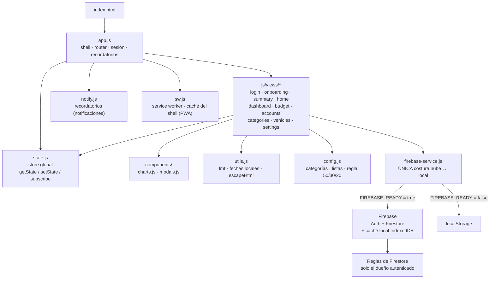
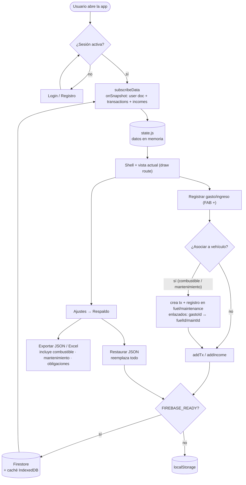
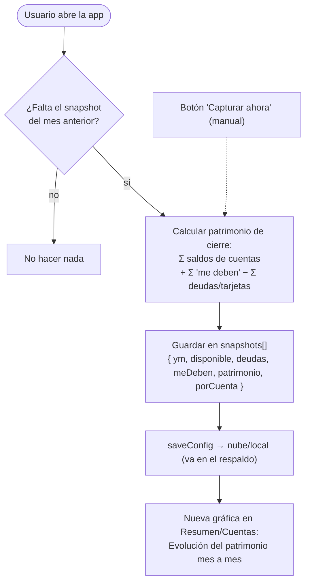

# Finanzas JDCH — PWA

App de finanzas personales: clasificación COICOP, presupuesto editable por mes (valor o %), tableros con comparativo 50/30/20 y canasta DANE, edición de categorías/subcategorías, importación de Excel y nube con usuarios (Firebase). Incluye un **módulo opcional de Vehículos** (combustible, mantenimiento y obligaciones legales como SOAT/tecnomecánica).

## Estado actual y cómo continuar (flujo de trabajo)

**Versión actual: caché v124.** Si retomas el proyecto desde otro equipo o el celular, sigue este flujo para no pisar cambios (una vez se duplicó trabajo por editar en paralelo).

**Arranque rápido en otra sesión (celular u otro PC):**
1. Abre Claude Code (web `claude.ai/code` o la app) con tu cuenta y conecta el repo `jdch1206/FINANZAS-JDCH`.
2. `git pull origin main` (trae lo último — vamos en v124). El desarrollo va directo sobre `main`.
3. Trabaja. Para probar local: `python -m http.server 8000` en la raíz del repo (no hay Node/npm).
4. En **cada cambio de código**: sube el caché del SW (`const CACHE = "finanzas-jdch-vNN"` en `sw.js`, NN+1) y anota el cambio en el changelog de abajo. Saltarse esto es la causa #1 de "mi cambio no se ve".
5. `git commit` + `git push origin main` al terminar (los cambios quedan como commit lineal sobre `main`; ver el changelog para el historial de versiones).

**Reglas fijas:**
- **Nunca** subas `datos/` ni `documentacion/` (datos personales reales; ya en `.gitignore`). Solo `app/` está en GitHub.
- Convenciones: UI en español · dinero en enteros COP · fechas en hora local (nunca `toISOString` para "hoy") · `escapeHtml()` en todo valor del usuario dentro de `innerHTML`.
- Probar en una copia aislada con `FIREBASE_READY = false` antes de desplegar; nunca contra los datos reales de la nube.

Qué hace cada pantalla: ver **Módulos (pantallas)** y **Arquitectura** más abajo. Historial completo: en el changelog.

> **Seguridad:** las claves de `firebase-config.js` son **públicas por diseño** (config de cliente); lo que protege los datos son las **reglas de Firestore** (solo el dueño autenticado lee/escribe lo suyo). Nunca se suben claves privadas (`serviceAccount*.json`, `.env`) — bloqueadas en `.gitignore`.

## Mapa de arquitectura

Cómo se conectan las piezas. Todo corre en el navegador (archivos estáticos); `firebase-service.js` es la única costura que decide, en tiempo de ejecución, si los datos van a la nube (Firebase) o al almacenamiento local.


```mermaid
flowchart TD
  IDX["index.html"] --> APP["app.js<br/>shell · router · sesión · recordatorios"]
  APP --> VIEWS["js/views/*<br/>login · onboarding · summary · home<br/>dashboard · budget · accounts<br/>categories · vehicles · settings"]
  APP --> STATE["state.js<br/>store global<br/>getState / setState / subscribe"]
  VIEWS --> STATE
  VIEWS --> COMP["components/<br/>charts.js · modals.js"]
  VIEWS --> UTILS["utils.js<br/>fmt · fechas locales · escapeHtml"]
  VIEWS --> CFG["config.js<br/>categorías · listas · regla 50/30/20"]
  APP --> NOTIFY["notify.js<br/>recordatorios (notificaciones)"]
  VIEWS --> SVC["firebase-service.js<br/>ÚNICA costura nube ↔ local"]
  APP --> SW["sw.js<br/>service worker · caché del shell (PWA)"]
  SVC -->|"FIREBASE_READY = true"| CLOUD["Firebase<br/>Auth + Firestore<br/>+ caché local IndexedDB"]
  SVC -->|"FIREBASE_READY = false"| LOCAL["localStorage"]
  CLOUD --> RULES["Reglas de Firestore<br/>solo el dueño autenticado"]
```

## Mapa de procesos

Flujos principales: arranque y carga de datos, registro de un movimiento (con la opción de enlazarlo a un vehículo) y respaldo/restauración.


```mermaid
flowchart TD
  START(["Usuario abre la app"]) --> AUTH{"¿Sesión activa?"}
  AUTH -->|no| LOGIN["Login / Registro"]
  LOGIN --> AUTH
  AUTH -->|sí| LOAD["subscribeData<br/>onSnapshot: user doc + transactions + incomes"]
  LOAD --> STATE[("state.js<br/>datos en memoria")]
  STATE --> SHELL["Shell + vista actual (draw route)"]

  SHELL --> ADD["Registrar gasto/ingreso (FAB +)"]
  ADD --> VEH{"¿Asociar a vehículo?"}
  VEH -->|no| SAVE["addTx / addIncome"]
  VEH -->|"sí (combustible / mantenimiento)"| LINK["crea tx + registro en fuel/maintenance<br/>enlazados: gastoId ↔ fuelId/maintId"]
  LINK --> SAVE
  SAVE --> SEAM{"FIREBASE_READY?"}
  SEAM -->|sí| FS[("Firestore<br/>+ caché IndexedDB")]
  SEAM -->|no| LS[("localStorage")]
  FS --> LOAD

  SHELL --> BK["Ajustes → Respaldo"]
  BK --> EXP["Exportar JSON / Excel<br/>incluye combustible · mantenimiento · obligaciones"]
  BK --> IMP["Restaurar JSON<br/>reemplaza todo"]
  IMP --> SEAM
```

## Roadmap y mejoras propuestas

Comparación con apps de finanzas populares (Monarch, YNAB) y de código abierto (Firefly III, Actual Budget, ezBookkeeping). Marcado según se puede hacer **con los recursos actuales** (JS puro, sin backend, Firebase gratis) o no.

**Lo que la app ya tiene** (a la par de esas apps): multi-cuenta, categorías/subcategorías, presupuesto por mes (valor/%), 50/30/20 + DANE, tablero con drill-down y calendario, gastos recurrentes, metas, deudas/tarjetas, transferencias entre cuentas, rentabilidad E.A., insights, reporte PDF, import/export Excel-JSON, respaldo completo, recordatorios, caché offline, modo oscuro.

**Mejoras propuestas** (prioridad según valor/esfuerzo):

| Mejora | Qué aporta | Viable ahora |
|---|---|---|
| ~~**Patrimonio mensual (snapshot)**~~ ✅ **hecho (v81)** | Foto del patrimonio al cierre de cada mes → ver cómo evoluciona mes a mes | Implementado en Cuentas |
| ~~**Etiquetas (tags)** en movimientos~~ ✅ **hecho (v83)** | Marcar gastos transversales (ej. "viaje", "regalo") sin depender de la categoría | Implementado |
| ~~**Dividir un gasto** (split)~~ ✅ **hecho (v84)** | Un pago repartido en varias categorías (ej. mercado + aseo en una compra) | Implementado |
| ~~**Autocompletar comercio/descripción**~~ ✅ **hecho (v82)** | Sugerir descripciones ya usadas al escribir | Implementado (sin lecturas extra) |
| **Presupuesto con arrastre (rollover)** | Lo no gastado pasa al mes siguiente (estilo YNAB) | ✅ Sí |
| **Bloqueo con PIN** | Capa de privacidad al abrir la app (dato sensible) | ✅ Sí |
| ~~**Filtros guardados / búsqueda avanzada**~~ ✅ **hecho (v85)** | Guardar vistas frecuentes en Movimientos | Implementado (por dispositivo) |
| **Adjuntar foto de recibo** | Guardar la imagen del recibo en cada gasto | ⚠️ Requiere Firebase Storage |
| **Sincronización bancaria automática** | Importar movimientos del banco sin digitar | ❌ Requiere backend/servicio pago |
| **Multi-moneda / multi-usuario** | — | ❌ No aplica (uso personal, COP) |

### Próxima mejora recomendada: Patrimonio mensual

Idea: guardar automáticamente, al cambiar de mes, una **foto del patrimonio** (saldo de todas las cuentas + lo que te deben − lo que debes) para graficar su evolución mes a mes. Se construye hacia adelante (no se puede reconstruir el pasado con fiabilidad). Datos en un campo `snapshots[]` del doc de configuración (incluido en respaldo). Viable con los recursos actuales.


```mermaid
flowchart TD
  OPEN(["Usuario abre la app"]) --> CHK{"¿Falta el snapshot<br/>del mes anterior?"}
  CHK -->|no| SKIP["No hacer nada"]
  CHK -->|sí| SNAP["Calcular patrimonio de cierre:<br/>Σ saldos de cuentas<br/>+ Σ 'me deben' − Σ deudas/tarjetas"]
  SNAP --> STORE["Guardar en snapshots[]<br/>{ ym, disponible, deudas, meDeben, patrimonio, porCuenta }"]
  STORE --> SAVE["saveConfig → nube/local (va en el respaldo)"]
  BTN["Botón 'Capturar ahora' (manual)"] -.-> SNAP
  SAVE --> CHART["Nueva gráfica en Resumen/Cuentas:<br/>Evolución del patrimonio mes a mes"]
```

> Estado del código: auditado en **v80**, consistente con las convenciones (escapeHtml, COP, fechas locales, respaldo, costura nube/local). Nota de escala: los movimientos de cuenta (`accounts[].movs`) y abonos de deuda (`debts[].abonos`) viven en el doc de configuración; para uso personal aguanta años, pero si crecen mucho conviene moverlos a subcolecciones.

## Novedades (changelog)

La app no usa versión numérica formal; la referencia técnica es la constante `CACHE` del service worker (`sw.js`), hoy **v124**. Cambios por fecha (más reciente primero):

### 2026-10-03 · caché v124 — Reporte PDF en documento aparte (siempre claro)
- 🐛 v123 no bastó: Chrome seguía pintando la capa oscura sobre el reporte. Ahora el reporte se imprime desde un **documento aparte (iframe)** que solo tiene estilos claros (`color-scheme: only light`, fondo blanco, sin el tema de la app), con título "Finanzas JDCH · Reporte <mes>" (nombre sugerido del PDF). Se elimina el área de impresión dentro de la app.

### 2026-10-03 · caché v123 — Reporte PDF salía negro
- 🐛 Con **"tema oscuro para sitios"** de Chrome (Android), el navegador oscurecía por su cuenta la página al imprimir: el PDF traía una capa gris oscura (#1f1f1f) encima del reporte y el texto no se veía. La app ahora declara `color-scheme` (oscuro propio; claro si eliges el tema claro) y al imprimir fuerza **`only light`**, que le prohíbe a Chrome oscurecer el reporte. El área del reporte también fija fondo blanco y texto oscuro.

### 2026-10-03 · caché v122 — IA: medio de pago y cuenta por movimiento en la revisión
- 🧾 En la pantalla de revisión (dictado y extracto) **cada gasto muestra su propio medio de pago y cuenta**, ya llenos: lo que dijiste («con la tarjeta Nu») o, si no lo dijiste, el medio y la cuenta con los que **sueles pagar esa descripción**; la cuenta de cada medio sale de la última usada o de la más frecuente. Efectivo oculta la cuenta.
- Los selectores de arriba pasan a ser **«Poner a todos»**: aplican el medio o la cuenta a todos los movimientos de una vez y luego se pueden ajustar uno por uno. Al guardar se recuerda la cuenta de cada medio de pago (igual que el formulario normal).

### 2026-10-03 · caché v121 — IA: diagnóstico de App Check en "Probar conexión"
- 🔎 **Probar conexión** pide primero el token de App Check por separado y, si falla, dice si el problema es la **clave/dominio** (Fraud Defense no validó la página) o el **registro en Firebase** (la clave pegada no es la registrada en App Check para esta app web), con el detalle técnico. Los fallos de red momentáneos no se reportan como error de clave.

### 2026-10-03 · caché v120 — IA: la clave de sitio se aplica sin recargar a mano
- 🐛 App Check solo se puede iniciar una vez por carga de página: si se probaba la conexión antes de pegar la clave (o con otro proveedor), la clave nueva no se usaba y salía "App Check rechazó la consulta" aunque estuviera bien. Ahora, al guardar una clave o proveedor distinto, la app **recarga sola** para aplicarlos.
- 🔎 El error de App Check muestra el detalle técnico entre corchetes (para saber si es la clave, el dominio o el proveedor) y avisa si falta la clave.

### 2026-10-02 · caché v119 — Más IA: dictado, extractos PDF, preguntas y análisis en el Tablero (integrado a `main`)
- 🎤 **Movimientos → Dictar o escribir**: dices o escribes "ayer almuerzo 18 mil en efectivo y una coca cola de 4500" y la IA arma los movimientos (varios por frase; fechas relativas; "mil"/"millones"/"palos"; gasto o ingreso; categoría, medio de pago y cuenta solo de tus listas). Voz con el reconocimiento del navegador (español Colombia).
- 📄 **Movimientos → Importar extracto** (PDF o foto, máx 15 MB): lee extractos del banco/tarjeta y facturas electrónicas; marca **transferencias entre tus cuentas / pagos de tarjeta** y **posibles duplicados** (mismo valor ±1 día) para que no se importen por error. El archivo no se guarda.
- ✅ Todo pasa por una **pantalla de revisión**: casilla por movimiento, fecha, tipo, descripción, valor, categoría›sub (la que tú sueles usar con esa descripción manda) o tipo de ingreso (deducido: nómina→Salario, intereses→Rendimientos…), medio de pago y cuenta globales. Nada se guarda sin confirmar.
- 📈 **Avanzado → Proyección del mes** (sin IA): cuánto llevas y en cuánto cerrarías, usando el ritmo de tus meses anteriores a esta misma altura del mes (el arriendo del día 1 no infla la proyección); compara con tu promedio y avisa si superarías el ingreso.
- 🚨 **Avanzado → Gastos inusuales** (sin IA, últimos 45 días): gastos ≥1,8× lo normal para esa misma descripción (o ≥3× su subcategoría si es nuevo).
- ✨ **Avanzado → Análisis del mes con IA**: el mismo análisis del reporte PDF en pantalla, por mes; queda guardado en el equipo y solo se recalcula si cambian los movimientos de ese mes.
- ❓ **Avanzado → Pregúntale a tus datos**: preguntas libres ("¿cuánto gasté en domicilios en los últimos 3 meses?"). La IA solo elige **funciones de consulta** (totales, por categoría, por descripción, más grandes, búsqueda, ingresos, resumen mensual, saldos) que **la app calcula** con tus datos; la IA no ve la lista completa de movimientos.
- ✅ Verificado con Gemini real y datos sintéticos: dictado de 3 movimientos ≈23 s; extracto PDF de 8 líneas ≈24 s (transferencia propia y nómina duplicada detectadas); pregunta con 8 consultas ≈29 s; análisis ≈41 s. Si un modelo devuelve 429 salta al siguiente.

### 2026-10-02 · caché v118 — IA con Gemini (integrado a `main`)
- 🔧 **Firebase JS SDK 10.12.2 → 12.19.0** (`FB_VER` en `firebase-service.js`; todos los módulos de la misma versión). Necesario para **Firebase AI Logic**. Se verificó que las 21 funciones de Firebase que usa la app existen en 12.19.0 y que la app arranca igual que con 10.12.2.
- 🤖 Nuevo **`js/ai.js`**: conexión con **Firebase AI Logic (Gemini Developer API, plan gratis)** — la clave de Gemini la guarda Firebase, no la app. **App Check** con reCAPTCHA v3 (obligatorio para AI Logic desde el 2-nov-2026); en el PC (`localhost`) usa el token de depuración. **Cadenas de modelos por tarea** (`vision`, `texto`): si un modelo agota su cupo, no existe o está saturado, salta al siguiente; contador de **uso de hoy** por modelo (reinicio ≈ 2 a. m. Colombia). Respuestas con **esquema JSON** validado por la app.
- 📸 **Fotos**: botones **Tomar foto** (cámara) y **Cargar foto** (galería); la imagen se reduce en el dispositivo (máx 1600 px, JPEG) y **no se guarda**.
- 🧾 **Leer recibo con IA** (Compra con varios productos): llena tienda, fecha, total y productos (nombre, cantidad, valor, categoría › subcategoría). La categoría con la que **tú** sueles registrar un producto tiene prioridad sobre la de la IA. IVA o descuento que la factura muestra solo al final se **reparten** proporcionalmente en las líneas; la verificación contra el total del recibo ya existente avisa si no cuadra.
- 🔧 **Leer factura del taller con IA** (orden de trabajo): llena taller, fecha y líneas (clasificación, **tipo estricto** de la lista —si no encaja va como "Otro" con el texto en la descripción—, descripción, referencia, cantidad, valor) y avisa si la suma no coincide con el total.
- ⚙️ **Ajustes → 🤖 Inteligencia artificial**: activar/desactivar (apagada por defecto), clave de sitio reCAPTCHA, cadenas de modelos, **Probar conexión** y uso de hoy. Configuración en `profile.ai` (sincronizada).
- 📄 Guía de prueba en **`PRUEBA-IA.md`** (activar AI Logic, abrir la rama en el PC, registrar el token de depuración de App Check, probar).
- 🧠 **Análisis del mes en el reporte PDF** (casilla "✨ Incluir análisis del mes con IA" en Ajustes → Reporte mensual): la app calcula las cifras exactas (`datosMes`: ingresos, gastos, balance, tasa de ahorro, mes anterior, promedio 12 meses, 50/30/20, por categoría, gastos más grandes y repetidos, **aportes a cuentas y rendimientos**) y la IA solo redacta resumen, 3–5 hallazgos (✅/⚠️/ℹ️) y 2–3 recomendaciones, sin recalcular cifras. Cadena de modelos propia (`analisis`).
- 📑 **Reporte mensual PDF ampliado** (funciona con o sin IA): KPIs con variación vs mes anterior; **Comparativo** (este mes · mes anterior · mismo mes del año anterior: ingresos, gastos, balance, tasa de ahorro, n.º de gastos, gasto diario, con Δ coloreado); **Flujo del dinero** (el diagrama de cintas del Tablero, `buildSankey` exportado, con abono a cuentas); **Gasto por categoría** con Δ vs mes anterior y vs año anterior + promedio 12 meses; **Presupuesto vs real** con barra de ejecución (si hay presupuesto ese mes); **Gasto por día** (mapa de calor tipo calendario + gasto por día de la semana + día de mayor gasto); **Gastos destacados** (más grandes y más repetidos); **Ahorro y patrimonio** (sobrante, abonado a cuentas, rendimientos y cambio de patrimonio si hay cierres guardados). Secciones sin cortes entre páginas y colores de fondo forzados al imprimir. Los datos para la IA incluyen ahora el mismo mes del año anterior.
- 🐛 Nota del diagrama de flujo: "abonaste más de lo que sobró" ahora dice "se cubrió con saldo que ya tenías" (quedaba el texto viejo de v106).
- ✅ Verificado contra el proyecto real (2-oct-2026): responden `gemini-3.8/3.7/3.6/3.5-flash`, `gemini-3-flash-preview`, `gemini-3.5-flash-lite`, `gemini-3.1-flash-lite`. Leer documentos usa **razonamiento bajo** (`thinkingLevel: LOW`): recibo ≈16 s, factura ≈17 s (antes 47–90 s). Recibo de prueba (8 productos, IVA al final) y factura de taller (6 líneas) leídos con suma = total. Un rechazo de App Check se reintenta 1 vez (puede ser falla momentánea de red).

### 2026-10-02 · caché v117 — Compras agrupadas en la lista + recibo completo
- 🧾 En **Movimientos**, los productos de una **Compra con varios productos** se muestran como **una sola fila**: "🧾 Éxito · 3 productos · $28.500", con fecha, número de categorías, medio de pago y los primeros productos.
- Al tocarla se abre el **recibo completo**: tienda, fecha, medio de pago, cuenta, total, total por categoría y la lista de productos (cantidad, categoría › subcategoría, valor). Desde ahí: tocar un producto para **editarlo**, **+ Agregar producto que faltó** (hereda fecha, pago, cuenta, etiquetas y vínculo; propone la categoría aprendida) y **Borrar compra completa**.
- Al **buscar texto** o filtrar por **categoría** o **monto**, los productos salen **sueltos** (para encontrarlos uno a uno, con su ÷). Con los demás filtros (mes, cuenta, medio de pago, etiqueta) se ven agrupados.
- En la edición de un producto aparece **🧾 Ver compra completa**.
- La agrupación es solo visual: totales, presupuesto, gráficas, Seguimientos y gasto hormiga siguen contando cada producto.

### 2026-10-02 · caché v116 — Etiquetas sin distinguir mayúsculas ni tildes
- 🏷️ "Éxito", "exito", "EXITO" y "#Éxito" ahora son **la misma etiqueta**: el filtro las encuentra todas, la lista de etiquetas muestra una sola (la escritura más usada) y al escribir una etiqueta que ya existe con otra forma se **reutiliza la escritura existente** (formulario de gasto y Compra con varios productos). Antes cada variante era una etiqueta distinta.
- Recordatorio: la herramienta **Unificar descripciones** cubre también los productos de una Compra con varios productos (cada uno es un gasto con su propia descripción); las etiquetas no lo necesitan porque ya se reconocen como iguales.

### 2026-10-02 · caché v115 — Unificar descripciones (recomendación, no imposición)
- 🧹 Nueva tarjeta **Ajustes → Limpieza de datos → Unificar descripciones (N sugerencias)** (módulo `js/views/unificar.js`). Detecta gastos que son lo mismo escrito de varias formas (mayúsculas, tildes, signos, plural simple, espacios: "Almuerzo/Almuerzos/almuerzo", "Coca cola/Cocacola/Coca Cola", "Empanadas/Empanada"…) y muestra cada grupo con sus variantes y cuántos gastos tiene cada una.
- Es solo una **recomendación**: todos los grupos vienen **desmarcados**; marcas los que quieras, eliges cómo dejarlos (cualquiera de las variantes —incluido el plural— u "Otra…" escrita a mano) y aplicas. **Mantener así** saca el grupo de las sugerencias para siempre (`profile.unifIgnore`). Solo cambia la descripción exacta del gasto; montos, categorías y descripciones combinadas no se tocan.

### 2026-10-02 · caché v114 — Sugeridos de Seguimientos a la vista
- 🎯 Los seguimientos sugeridos (Coca cola, Gaseosa, Empanadas, Cerveza, Café, Postres, Parqueadero) ahora aparecen **directamente en la tarjeta Seguimientos** como botones "+ Nombre": un toque y queda agregado (antes solo se veían dentro de "+ Agregar").

### 2026-10-02 · caché v113 — "Compra con varios productos" (seguimiento por ítem)
- 🧾 "Dividir gasto" pasa a ser **Compra con varios productos**: para un recibo grande (ej. mercado) se carga cada **producto** con su **nombre, cantidad, valor, categoría y subcategoría**. Cada producto se guarda como un **gasto propio con su nombre** ("Coca cola", no "Compra Éxito"), así entra en búsquedas, **Seguimientos**, gasto hormiga y recurrentes igual que una compra suelta. Todos quedan unidos como una sola compra (`splitId`, símbolo ÷) y llevan la **tienda como etiqueta** (filtrar por ella muestra el recibo completo con su total).
- 🧠 Al escribir un producto ya conocido, propone la **categoría/subcategoría con la que sueles registrarlo** (aprendido del historial). Un producto nuevo arranca con la categoría del anterior.
- ✅ Campo opcional **Total del recibo** para verificar: avisa si faltan o sobran pesos.
- 🔢 Nuevo campo `qty` (cantidad) en los gastos: se muestra como "x6" en la lista y **Seguimientos** calcula el precio típico **por unidad**.
- 🐛 Al editar un gasto que hacía parte de una compra dividida se perdía su vínculo (÷); ahora se conservan `splitId` y `qty`.

### 2026-10-02 · caché v112 — Seguimientos por producto + unificar escritura
- 🎯 Nueva tarjeta **Seguimientos** en **Tablero → Avanzado** (módulo `js/views/seguimientos.js`). Eliges productos o gastos (Coca cola, Gaseosa, Cerveza, Café…) con sus **palabras clave**; la app los busca en la descripción de **todo el historial** (sin importar mayúsculas, tildes ni plurales), así que no hay que cambiar la forma de registrar. Por cada uno muestra: veces, frecuencia y gasto por mes, última compra, **Exacto** (gastos que son solo ese producto, o una parte propia de un gasto dividido) vs **Compartido** (descripciones combinadas como "Empanadas y gaseosa": cuenta la vez, pero el monto incluye otras cosas), **precio típico por año** (mediana de las compras exactas) y barras de los últimos 12 meses. Se guardan en `profile.seguimientos` (sincronizado). Incluye sugeridos.
- ✏️ **Unificar escritura** (menú ⋯ de cada seguimiento): reescribe en los gastos todas las variantes del nombre ("coca cola", "Coca Cola", "Cocacola", "coca-cola" → "Coca cola"), cambiando solo esa palabra dentro de la descripción, con vista previa. Opcionalmente mueve a una subcategoría elegida los gastos que son **exactamente** ese producto (p. ej. Coca cola → Alimentación › Snacks y bebidas).

### 2026-10-02 · caché v111 — Dividir gasto con subcategoría + total por etiqueta/filtro
- ➗ **Dividir gasto**: cada parte ahora tiene **categoría › subcategoría** (antes la subcategoría se ponía sola en la primera de la lista, p. ej. aseo quedaba en "Ropa y calzado"), **monto** y **detalle opcional** (se agrega a la descripción: "Compra Éxito · jabón, shampoo", así se ve y se busca). Nuevo campo de **etiquetas para todo el recibo** (p. ej. `exito`), que se aplica a todas las partes.
- 🏷️ **Total al filtrar**: en Movimientos, cuando hay un filtro activo (etiqueta, mes, categoría, cuenta, medio de pago, monto o búsqueda) aparece arriba un resumen: **total**, número de gastos, promedio mensual (si abarca varios meses) y **en qué se fue por categoría** (o por subcategoría si ya filtraste una categoría). Ej.: filtrar `#exito` muestra cuánto has gastado en esa tienda y repartido en qué.

### 2026-10-02 · caché v110 — Gasto hormiga de verdad (no todo lo repetido lo es)
- 🐜 Antes la lista tomaba cualquier gasto repetido ≥3 veces (salían Arriendo, Gasolina, SOAT, Póliza, Seguridad social, Parqueadero…). Ahora un gasto hormiga debe ser **pequeño** (promedio ≤ $35.000), **frecuente** (≥3 veces) y **prescindible**:
  - Se excluyen subcategorías necesarias o fijas (`HORM_EXCL_SUBS`: arriendo, servicios, mercado, transporte público, parqueadero, combustible, mantenimiento, pólizas, lavado, salud, celular/internet/suscripciones, educación, impuestos, trámites, ajustes, ayudas, regalos, alojamientos, aseo, peluquería).
  - Se excluyen las comidas principales (almuerzo, desayuno, cena, comida, onces, mercado, compras).
- ✕ Botón por ítem **"No es gasto hormiga"**: lo saca de la lista y se recuerda (en `profile.hormigaExcl`, sincronizado). Sección plegable "Excluidos a mano" para restaurarlos.
- 🔗 Las compras se agrupan sin tildes ni plurales ("Empanadas" = "Empanada", "Helados" = "Helado"), también en la lista de posibles recurrentes.

### 2026-10-02 · caché v109 — Los aportes de fin de mes cuentan para el mes de su salario
- 📅 Si el salario llega a fin de mes pero se registra el día 1°, el aporte que se hace ese fin de mes sale de **ese** salario. Regla (`fechaAporte`): un aporte hecho en los **últimos 7 días del mes** cuenta para el **mes siguiente** cuando ese mes tiene un ingreso registrado entre el día 1 y el 3. Ej.: el aporte del 28-sep cuenta para octubre.
- Aplica al Flujo del dinero (Abono a cuentas), a la conciliación por período (la fila de aportes indica qué fechas se movieron) y al corte acumulado (en un corte pasado, ese aporte se trata como posterior al corte).
- ✏️ "Abonado de más" ya no se llama "adelanto del mes siguiente": se cubrió con saldo que ya tenías. El aviso de faltante ya no supone que falta abonar el mes en curso; apunta a la cuenta de nómina no registrada (y sugiere registrarla en Cuentas para que cuadre).

### 2026-10-02 · caché v108 — Comparación acumulada al día (igual al Balance del Resumen)
- 📈 Si el período incluye el mes en curso, "Lo que tienen tus cuentas vs. lo que deberían" se calcula **hasta hoy** con **todos** los registros, de modo que el "Sobrante acumulado" es el mismo número que **Balance (ingresos − gastos)** del Resumen. Deberías tener = ese Balance + rendimientos registrados; se compara contra el saldo disponible de las cuentas.
- Si falta dinero, el aviso aclara que incluye lo que sobró en el mes en curso y que quizá aún no se ha abonado.

### 2026-10-02 · caché v107 — Saldo real de las cuentas vs. lo que deberían tener
- 📈 Nueva sección en la conciliación: **"Lo que tienen tus cuentas vs. lo que deberían"**. Compara el **saldo de las cuentas líquidas** a la fecha de corte (saldo actual − movimientos posteriores) contra **todo el sobrante registrado** (Σ ingresos − gastos desde el primer registro) + rendimientos registrados. Así lo ahorrado antes de empezar a registrar aportes (que ya está en el saldo inicial de las cuentas) sí se tiene en cuenta.
- Fecha de corte: fin del período elegido (en la vista anual sin el mes en curso; "hoy" si es el mes actual). No aparece si a esa fecha aún no había cuentas en la app.
- 🌊 En el Flujo del dinero, si el período empieza antes de registrar aportes (ej. 2026 completo), el sobrante ya no se parte en "Sin abonar": se muestra entero, con una nota que remite a esta comparación.

### 2026-10-02 · caché v106 — Abonar de más = adelanto del mes siguiente
- ✏️ Cuando se abona a cuentas más de lo que sobró en el período, ya no se sugiere "otra fuente" ni "ingresos sin registrar" (todos los ingresos se registran). Ahora se muestra en tono neutro como **"adelanto del mes siguiente"**, que se compensa al ver el año completo. Aplica al Flujo del dinero y a la tarjeta de conciliación.

### 2026-10-02 · caché v105 — Sobrante vs. abono a cuentas en el Flujo del dinero
- 🏷️ Lo que queda de Ingresos − Gastos ahora se llama **"Sobrante"** (no "Ahorro"), porque en la práctica no todo lo que sobra se ahorra.
- 🟩 En la columna final el Sobrante se divide en **"Abono a cuentas"** (verde: el ahorro real, aportes netos registrados en Cuentas sin rendimientos ni transferencias) y **"Sin abonar"** (verde tenue: sobró pero no llegó a ninguna cuenta registrada).
- Si abonaste más de lo que sobró, todo el sobrante aparece como abono y un aviso indica cuánto salió de otra fuente. Si el período no tiene aportes registrados, se muestra solo "Sobrante". Si los aportes se empezaron a registrar a mitad del período, una nota lo aclara.
- La tarjeta de conciliación pasa a llamarse **"¿Tu sobrante llegó a las cuentas?"** con los mismos términos.

### 2026-10-02 · caché v104 — "¿Tu ahorro llegó a las cuentas?" (conciliación)
- 🔎 Nueva tarjeta en **Tablero → Avanzado**, debajo del Flujo del dinero y con el **mismo período** (año o mes). Compara el **ahorro según tus registros** (Ingresos − Gastos) contra los **aportes netos a cuentas** (sumas/aportes menos retiros; sin rendimientos ni transferencias entre cuentas, sin cuentas "Por cobrar").
- Si hay deudas con abonos en el período, también entran: **+ pagos a deudas** (tu ahorro se usó para bajar deuda), **− compras a crédito** (gasto que no salió de tu bolsillo) y **− pagos que te hicieron** (dinero que entra sin ser ingreso). Sin deudas, esas filas no aparecen.
- Veredicto: ✅ **Cuadra** (diferencia ≤ máx($50.000, 2% de ingresos)), ⚠ **Faltan X por ubicar** (efectivo, cuenta no registrada, gastos sin anotar) o ⚠ **Aportaste X más** (salió de efectivo/saldo anterior o hay ingresos sin registrar).
- Solo compara desde el mes en que empezaste a registrar aportes (antes no hay con qué comparar). En la vista anual se **excluye el mes en curso**; si eliges el mes actual se avisa que aún no termina. Los rendimientos se informan aparte.

### 2026-10-02 · caché v103 — Flujo del dinero por mes
- 📅 Junto al selector de año ahora hay un selector de **mes** ("Todo el año" por defecto + los meses de ese año con movimientos). El Sankey, los totales de Ingresos/Gastos/Ahorro y el aviso de déficit se calculan para el período elegido; los % pasan a ser "sobre tus ingresos del mes".
- Al cambiar de año el mes vuelve a "Todo el año".

### 2026-10-02 · caché v102 — Rediseño del "Flujo del dinero" (Sankey)
- 🎨 Antes: 12 categorías con colores de una paleta que se repetían o parecían (Salud y Ahorro con el mismo verde) y una leyenda aparte que había que descifrar.
- ✅ Ahora: **3 columnas** que cuentan la historia → **Ingresos → Reparto (Gastos | Ahorro) → En qué se fue**. El **color codifica el significado**, no la categoría: dorado = ingreso, gris = gasto, verde = ahorro, rojo = déficit (cuando se gastó más de lo que entró).
- 🏷️ Cada categoría lleva **etiqueta directa** (nombre, valor y % de los ingresos) junto a su barra; sin leyenda. Se muestran las **7 más grandes** y el resto se agrupa en "Otras (n)" (al tocarla se ve el detalle).
- 👆 Tocar/pasar sobre una banda muestra el valor exacto; la banda se resalta.

### 2026-10-02 · caché v101 — Fix: "Quitar duplicados" marcaba líneas de órdenes de trabajo
- 🐛 El detector de duplicados de Mantenimiento contaba como repetidos los registros con el mismo `gastoId`. Las líneas de una **orden de trabajo** comparten `gastoId` a propósito (varias líneas → un solo gasto), así que una orden de 6 líneas aparecía como "5 duplicados" y el botón las habría **borrado**. Ahora `dupeCount`/`planDedupe` ignoran los registros con `visitaId`.

### 2026-10-02 · caché v100 — "Reorganizar tipos" desaparece tras revisarlo
- ✅ Al aplicar, los registros **desmarcados** también quedan como revisados (campo `reorgOk: true`), así que no se vuelven a sugerir y el botón **desaparece** cuando no queda nada pendiente.
- ✅ Todo registro creado o editado a mano (ítem individual u orden de trabajo) nace con `reorgOk: true`: el botón **solo aparece con datos antiguos** o importados desde Movimientos (clasificados automáticamente). Un usuario nuevo nunca lo ve.
- Costo para la app: ninguno visible. Es una función pequeña que solo se calcula al abrir Mantenimiento y no cambia datos sin confirmación.

### 2026-10-02 · caché v99 — Reorganizar tipos de mantenimiento existentes
- 🗂️ Nuevo botón **"Reorganizar tipos (N sugerencias)"** en Mantenimiento: propone un Tipo/Clasificación más específico para los registros ya guardados y deja **revisar uno a uno** (con casillas) antes de aplicar. Solo cambia la bitácora; **ningún gasto de Movimientos se toca**.
- Reglas (`suggestMaintTipo` en `config.js`): (1) nombres antiguos → actuales (`Kit de arrastre` → `Kit de arrastre (cadena)`, `Llantas` → `Llantas (montaje)`, `Reparación` → `Reparación (otra)`…); (2) descripciones que empiezan por "Revisión…/Mantenimiento moto…" → **Revisión / diagnóstico** (son paquetes por km); (3) para tipos genéricos (Reparación/Otro) se busca por palabras clave: tapas/estrellada → Carrocería, grúa → Grúa / asistencia, rines/ruedas → Llantas, tijera → Suspensión, sensor → Sistema eléctrico, productos/lavar → Insumos · Productos de limpieza, protectores → Insumos · Accesorios, cadena → Kit de arrastre.
- ➕ Tipos nuevos que pedían los datos reales: **Carrocería / tapas**, **Grúa / asistencia** (Taller) y **Productos de limpieza** (Insumos).
- Con el respaldo del 1-oct: 45 de 56 registros reciben sugerencia y "Reparación" baja de **28 a 6** (quedan solo los realmente genéricos: retenedores, "Arreglo moto", etc.).

### 2026-10-02 · caché v98 — Listas de Tipo de mantenimiento reorganizadas y ampliadas
- 🗂️ Las tres listas de **Tipo** (Taller / Rutina / Insumos) se reordenaron **por sistema** (motor → transmisión → frenos/llantas → suspensión/dirección → eléctrico → general) para elegir más rápido.
- ➕ Se agregaron ítems comunes que faltaban: **filtro de aire, carburación/inyección, clutch/embrague, guayas/cables, líquido de frenos, rodamientos, suspensión/dirección, sistema eléctrico, revisión/diagnóstico** (Taller); **revisión de frenos y revisión general** (Rutina); y en **Insumos** ahora cada compra espeja a Taller (filtro de aire, pastillas, batería, etc.) para comparar "compré la pieza" vs "me la instalaron" en el histórico de precios.
- 🎯 El cajón genérico **"Reparación"** pasa a **"Reparación (otra)"** y queda como último recurso: con las nuevas opciones específicas deberías usarlo mucho menos, lo que hace los datos **filtrables de forma objetiva**.
- ℹ️ Los registros antiguos conservan su Tipo original aunque ya no esté en la lista (el formulario lo preserva al editar).

### 2026-10-02 · caché v97 — Orden de trabajo: campos como el ítem individual + Tipo estricto
- 🧱 Cada línea de la orden ahora usa **campos con etiqueta y el mismo espaciado** que el ítem individual (Clasificación, Tipo, Descripción, Referencia/Cantidad, Valor, Repetir cada km), en vez de inputs apretados.
- 🔒 El **Tipo** pasa a ser un **desplegable estricto** (solo se elige de la lista, dependiente de la clasificación); lo específico/libre va en **Descripción**. Si necesitas algo que no está, elige "Otro" y descríbelo.

### 2026-10-02 · caché v96 — Orden de trabajo: descripción por línea (aparte del tipo)
- ✍️ Cada línea de la orden ahora tiene un campo **Descripción / detalle (opcional)** separado del **Tipo**, igual que en el ítem individual. El Tipo sigue siendo la lista con sugerencias; la descripción guarda el detalle libre (marca, nota). En la bitácora, la descripción se muestra cuando difiere del tipo.

### 2026-10-02 · caché v95 — Patrimonio: "Por cobrar" ya no cuenta como disponible
- 🔴 **Fix (auditoría):** las cuentas tipo **"Por cobrar"** se contaban como dinero **disponible/líquido**, inflando "Total disponible" y el patrimonio. Ahora `netWorthNow` las separa: el líquido es solo Ahorro/Corriente/Efectivo/Inversión, y lo "Por cobrar" cuenta como **"te deben"** (igual que las deudas por cobrar del módulo). El patrimonio total no cambia, pero queda bien clasificado. Alineado en **Cuentas**, **Resumen** y **Tablero** (colchón/ahorro). La gráfica de patrimonio sigue siendo continua (usa el patrimonio total, que no varía).

### 2026-10-01 · caché v94 — Sankey de flujo + precio de gasolina por tipo
- 💵 **Diagrama Sankey** (SVG propio) en Tablero → Avanzado: muestra el **flujo del año** Ingresos → categorías de gasto (+ Ahorro), con cintas proporcionales y selector de año. `buildSankey`.
- ⛽ Nueva gráfica **"Precio por galón en el tiempo (por tipo)"** en Combustible: precio/galón (costo ÷ galones) promedio mensual, **separado por tipo** (Extra/Corriente/…), que era la forma correcta de compararlo. Helper `multiLine` nuevo en charts.

### 2026-10-01 · caché v93 — Tablero "Avanzado" + KPIs de rendimiento en Cuentas
- 🐜 Nueva pestaña **Avanzado** en el Tablero: **compras repetidas (gasto hormiga)** —lo que compras ≥3 veces, por total, con conteo y promedio— y **detección de posibles gastos fijos/recurrentes** (ítems que aparecen casi todos los meses y aún no están como recurrentes). `renderAvanzado`.
- 📊 **KPIs de rendimiento en Cuentas**: tarjeta con **Total ganado**, **Este año**, **Promedio/mes**, **Aportes** y **Rentabilidad promedio (% E.A.)**, calculados de los movimientos de tus cuentas.

### 2026-10-01 · caché v92 — Gasto: cuenta ligada al medio de pago
- 💳 Al registrar un gasto, **Efectivo oculta el campo Cuenta** (no aplica: el efectivo no sale de una cuenta rastreada); con **Tarjeta débito/crédito, Transferencia u otro**, el campo aparece y **se prellena con la última cuenta usada con ese medio** (recordada por dispositivo en `localStorage`, clave `fz_pay_acct`). Así los gastos no-efectivo quedan con cuenta casi solos y el filtro por cuenta se vuelve confiable, sin estorbar en los de efectivo.

### 2026-10-01 · caché v91 — Orden de trabajo: taxonomía unificada por línea (clasificación + tipo)
- 🧩 La **orden de trabajo** y el **ítem individual** ahora **comparten las mismas listas**: cada línea de la orden se clasifica en **Taller / Rutina / Insumos** (nivel 1) y elige un **tipo** de la lista dependiente (Cambio de aceite, Filtro, Frenos, Kit de arrastre, Bujía, Sincronización/válvulas, Batería, Reparación…) con opción de **escribir uno propio** (nivel 2). Así los datos quedan consistentes y **filtrables objetivamente** por clasificación o por tipo.
- 🧰 Las líneas se unificaron en **una sola lista** (antes Actividades/Repuestos por separado): **referencia y cantidad** aparecen solo cuando la clasificación es **Insumos**; el valor es el **total de la línea con IVA**. Hay una **clasificación por defecto** que heredan las líneas nuevas para capturar más rápido. "Accesorio" queda como **tipo dentro de Insumos**. (Reemplaza la lista Mantenimiento/Insumo/Accesorio/Otros de v89.)

### 2026-10-01 · caché v90 — Mantenimiento: botones más claros con descripción
- 🧭 Los tres botones de Mantenimiento se renombraron y ahora traen una línea que explica **qué hace cada uno y cuándo usarlo**: **🧾 Registrar orden de trabajo** (factura con varias líneas → un solo gasto), **🔧 Registrar ítem individual** (un solo servicio/repuesto, solo bitácora, no crea gasto) e **📥 Importar desde Movimientos** (vincula gastos ya registrados sin duplicarlos).

### 2026-10-01 · caché v89 — Visita de taller: clasificación por línea
- 🏷️ Cada línea de una visita ahora tiene un selector de **clasificación**: **Mantenimiento · Insumo · Accesorio · Otros** (actividades por defecto "Mantenimiento", repuestos "Insumo"). Se guarda como la categoría de la línea, con su color de etiqueta en la bitácora. Al editar una línea después, se conservan tanto su clasificación como su descripción/referencia. Constante `MAINT_CLASES`.

### 2026-10-01 · caché v88 — Atajo a "visita de taller" desde Movimientos
- 🧾 Al crear un gasto y elegir una **categoría de vehículo** (Moto/Carro) + subcategoría **Mantenimiento/reparaciones**, aparece automáticamente el botón **"Registrar como visita de taller (varias líneas)"**, que abre el formulario de visita (v87) con el vehículo preseleccionado y crea el gasto por el total. `openVisitModal` ahora es reutilizable (exportada, con callback) y recarga la bitácora antes de persistir para no pisar datos al abrirse desde Movimientos.

### 2026-10-01 · caché v87 — Mantenimiento: registrar visita con varias líneas (factura de taller)
- 🧾 Nuevo **"Registrar visita (varias líneas)"** en Mantenimiento: capturas la orden de trabajo del taller como **Actividades** (mano de obra) y **Repuestos** (con referencia, cantidad y valor unit). El **total se va sumando** en vivo; cada línea es un registro de la bitácora agrupado por `visitaId`. Los valores **incluyen IVA** (lo que pagas).
- 💸 La visita crea **un solo gasto** en Movimientos por el total (categoría del vehículo); su monto se administra desde la visita (en Movimientos queda de solo-lectura). Borrar el gasto borra la visita y viceversa; editar/borrar una línea recalcula el total y el gasto.
- 🧱 Cada línea guarda `referencia`/`cantidad`/`valorUnit` (base para el futuro "precio por repuesto en el tiempo"). El desglose por vehículo cuenta las visitas dentro de **Mantenimiento**. `openVisitModal`/`recalcVisitGasto`; campo `visitaId` en gastos y registros.

### 2026-10-01 · caché v86 — Etiquetas: fix del filtro con "#"
- 🐞 **Fix:** si escribías una etiqueta con numeral (`#viaje`), se guardaba con el `#` y además el chip mostraba `##viaje`; y como el autocompletado sugería la versión sin `#`, quedaban **dos etiquetas distintas** (`#viaje` y `viaje`) y el filtro por una no traía la otra. Ahora las etiquetas se **normalizan** (se quita el `#` inicial al guardar, listar y comparar), tanto para datos nuevos como viejos, así que `#viaje` y `viaje` son la misma y el filtro funciona. Helper `normTag`.
- 🔎 La **barra de búsqueda** ahora también busca dentro de las etiquetas (antes solo miraba descripción/categoría/subcategoría/tipo).

### 2026-08-30 · caché v85 — Filtros guardados en Movimientos
- 🔖 En Movimientos (Gastos) puedes **guardar la combinación de filtros actual** (mes, categoría, cuenta, medio, etiqueta, montos, búsqueda) con un nombre y reaplicarla con un toque; se muestran como chips, con ✕ para borrar. Se guardan **por dispositivo** (localStorage), así que **no generan lecturas a Firebase**.

### 2026-08-30 · caché v84 — Dividir un gasto (split)
- ➗ Nuevo botón **"Dividir en varias categorías"** en el modal de nuevo gasto: un mismo pago se reparte en varias partes (categoría + monto), compartiendo fecha, descripción, medio de pago y cuenta. Crea **un gasto por parte** (cada uno editable/borrable por separado), enlazados por un `splitId`; en la lista se marcan con "÷". Campo `splitId` añadido a los escritores de transacciones.

### 2026-08-30 · caché v83 — Etiquetas (tags) en gastos
- 🏷️ Cada gasto puede llevar **etiquetas** libres (ej. `viaje`, `regalo`) además de su categoría, para agrupar gastos que cruzan categorías. Se escriben separadas por coma (con autocompletado de las ya usadas), se muestran como chips en la lista y hay un **filtro por etiqueta** en Movimientos. Campo `tags[]` en cada transacción (añadido en `addTx`/`bulkUpdateTx`/`bulkSetTx`).

### 2026-08-30 · caché v82 — Autocompletar descripción/comercio
- ✍️ Al registrar un gasto o ingreso, el campo **Descripción** ahora sugiere textos que ya usaste antes (comercios, conceptos), ordenados por frecuencia (vía `<datalist>`). Acelera el registro y evita que el mismo comercio quede escrito de varias formas. **No genera lecturas a Firebase**: las sugerencias se arman de los movimientos ya cargados en memoria.

### 2026-08-30 · caché v81 — Patrimonio mensual (foto del cierre de mes)
- 🐞 Fix (modo local): `persistLocal` no guardaba `debts`/`debtsEnabled`/`snapshots`. En modo nube no afectaba; ahora el modo local persiste todo.
- 🏛️ Nueva tarjeta **Patrimonio mensual** en Cuentas: muestra tu patrimonio hoy (saldo de cuentas + lo que te deben − lo que debes) y un botón para **guardar la foto del mes**. Al acumular ≥2 fotos aparece la gráfica **evolución del patrimonio mes a mes**.
- 🗓️ **Aviso de cierre de mes**: el último día del mes (y en Cuentas los últimos 3 días) la app invita a **actualizar los saldos de las cuentas** y guardar la foto, para que el patrimonio quede fiel. Datos en `snapshots[]` del doc de config (incluidos en respaldo). Se construye hacia adelante.
- 💳 Módulo opcional **Deudas y préstamos** (se activa en Ajustes, aparece en "Más"). Registra tres tipos: **Debo**, **Me deben** y **Tarjeta de crédito** (con cupo, día de corte y día de pago). Resumen arriba: total que debes, total que te deben y cupo disponible. Cada deuda muestra su saldo y progreso; registras **abonos** (y en tarjetas, consumos/pagos) que ajustan el saldo, con historial. Datos en el doc de config (`debts[]`, `debtsEnabled`); incluidos en respaldo/restauración. Vista `debts.js`.

### 2026-08-24 · caché v79 — Ajustes: reporte mensual (PDF)
- 🖨️ Nuevo **Reporte mensual** en Ajustes: eliges un mes y se genera una hoja (resumen ingresos/gastos/balance/tasa, regla 50/30/20, top categorías y saldos de cuentas) lista para **imprimir o "Guardar como PDF"** desde el diálogo del navegador. Sin dependencias: usa `window.print()` con un `@media print` que oculta la app y muestra solo el reporte. Funciones `openReportModal`/`printReport`/`buildReportHTML`.

### 2026-08-24 · caché v78 — Tablero: calendario / mapa de calor
- 🗓️ Nueva pestaña **Calendario** en el Tablero: una grilla del mes donde cada día se colorea según cuánto gastaste (más intenso = más gasto), con selector de mes, total y días con gasto. Tocar un día abre la lista de sus movimientos. El día de hoy va resaltado en dorado. Funciones `renderCalendar`/`openDayModal`.

### 2026-08-24 · caché v77 — Resumen: insights / alertas proactivas
- 💡 Nueva tarjeta **"Para tu atención"** en Resumen que genera avisos automáticos de tus propios datos (sin nada nuevo que registrar): categoría que va camino a superar tu promedio, presupuesto del mes ya superado o en riesgo, días sin registrar gastos, y balance del mes (gastas más de lo que ingresó / buen ahorro). Muestra hasta 4, priorizando lo más urgente (rojo/amarillo/verde/dorado). Función `buildInsights`.

### 2026-08-24 · caché v76 — Cuentas: rentabilidad aproximada (% E.A.)
- 📊 En la gráfica "Así ha crecido tu dinero" (al elegir una cuenta) y en el modal de movimientos ahora se muestra la **rentabilidad estimada** en **% anual efectivo (E.A.)**, tipo el "9,80% / 11,00%" de Nu. Se calcula del último rendimiento registrado (rendimiento ÷ saldo previo) anualizado por los días del intervalo. Es una **aproximación** (no modela aportes ni el momento exacto al 100%).

### 2026-08-24 · caché v75 — Cuentas: transferencias entre cuentas
- ⇄ Nuevo botón **Transferir** en Cuentas (con ≥2 cuentas): mueve dinero de una cuenta a otra en un paso (resta en origen, suma en destino), con nota y fecha. Crea dos movimientos enlazados (`kind:"transfer"`, mismo `transferId`) que muestran "→ destino" / "← origen". Al **eliminar** una de las dos patas se borran ambas y se revierten los dos saldos. No afecta gastos ni ingresos.

### 2026-08-24 · caché v74 — Movimientos: filtros por cuenta y medio de pago + fix asociación
- 🔎 En **Movimientos** (pestaña Gastos) hay dos filtros nuevos: **por cuenta** y **por medio de pago**, junto a los de mes, categoría y monto. "Limpiar" también los reinicia.
- 🐞 **Fix:** al **editar** un gasto, el selector "Asociar a vehículo" (v72) aparecía en cualquier categoría — por eso se podía asociar un vehículo en Misceláneos › Sin clasificar. Ahora respeta la misma regla que al crear: solo aparece en categorías de vehículo (Moto, Carro…). En otras categorías se conserva la asociación existente sin borrarla.

### 2026-08-24 · caché v73 — Vehículos: desglose de "Lavado" más exacto
- 🎯 En el **desglose de gasto por vehículo**, el rubro **Lavado** ahora se detecta primero por la **subcategoría exacta "Lavado"** (categoría Moto) y, como respaldo, por la palabra `lavad…` en la subcategoría/descripción. Antes solo miraba el texto, así que una lavada con otra redacción podía caer en "Otros"; ahora es más preciso.

### 2026-08-24 · caché v72 — Vehículos: desglose de gasto + asociar vehículo al editar
- 🚗 En **Vehículos**, la línea "Gasto asociado a este vehículo" ahora es tocable y abre un **desglose** (dona + barras) que separa el gasto en **Combustible · Mantenimiento · Lavado · Obligaciones · Otros**, con conteo por rubro. Responde "¿cuánto llevo en lavadas de la moto?". Combustible/Mantenimiento salen de sus bitácoras (vínculo `fuelId`/`maintId`), Lavado se detecta por la descripción, y el resto va en Otros.
- ✏️ Al **editar un gasto** ya existente ahora aparece el selector **"Asociar a vehículo"** (antes solo salía al crear). Permite etiquetar/cambiar/quitar el vehículo de un gasto. Si el gasto está vinculado a un tanqueo/mantenimiento/obligación, se indica que su vehículo se administra desde ese módulo (para no dejar registros huérfanos).

### 2026-08-24 · caché v71 — Cuentas: gráfica "Así ha crecido tu dinero"
- 📈 Nueva tarjeta en **Cuentas** con la **evolución del saldo** en el tiempo (reconstruida de los movimientos de "Actualizar saldo"), con selector por cuenta o Todas. Debajo muestra **Rendimientos** y **Aportes** acumulados. Aparece cuando hay al menos 2 fechas con movimientos registrados.

### 2026-08-24 · caché v70 — Cuentas: actualizar saldo (rendimiento) + recordatorio semanal
- 📈 Nuevo botón **Actualizar saldo** en cada cuenta: escribes el nuevo total que ves en el banco y la app calcula sola el **rendimiento** (cuánto creció) y separa cualquier **aporte extra** con su nota. Ambos quedan como movimientos de la cuenta (tipo `rendimiento`/`aporte`), sin afectar gastos ni ingresos. Estilo "Así ha crecido tu dinero" de Nu.
- 🔔 **Recordatorio semanal** (sugerido cada viernes): la vista de Cuentas muestra una tarjeta con las cuentas de Ahorro/Inversión/Corriente pendientes de actualizar (≥7 días, o el viernes desde 5 días), con botón directo. Si tienes las notificaciones activadas, también llega el aviso una vez al día, junto con los de vehículos.
- 💹 El total disponible y el detalle por cuenta muestran cuánto llevas registrado en **rendimientos**. Cada fila indica hace cuántos días se actualizó.

### 2026-08-19 · caché v69 — Cuentas: movimientos propios (sumar/restar) con nota
- 💳 Cada cuenta en **Cuentas** tiene ahora un botón **+** para registrar **movimientos propios**: sumar o restar dinero al saldo con una **breve descripción** y fecha. Ajustan solo el saldo de esa cuenta y **no** afectan tus **gastos ni ingresos** (son aparte). Incluye historial por cuenta con opción de eliminar cada movimiento (revierte el saldo), y el conteo de movimientos se muestra bajo el nombre de la cuenta.

### 2026-07-25 · caché v68 — Valor por galón también al abrir el tanqueo
- ⛽ Al abrir (editar) un tanqueo, el resumen superior ahora incluye **Valor por galón** de esa compra (costo ÷ galones), junto al rendimiento, pesos por km y distancia del tramo. Se muestra en todos los tanqueos, incluso los que no cierran un tramo.

### 2026-07-25 · caché v67 — Combustible: valor por galón en cada tanqueo
- ⛽ Cada renglón de la bitácora de Combustible ahora muestra el **valor por galón** de ese tanqueo (costo ÷ galones), ej.: `2.57 gal · $18.483/gal · 43.247 km · …`. Complementa el "Valor prom./galón" del resumen.

### 2026-07-25 · caché v66 — Combustible: valor promedio por galón
- ⛽ Nuevo indicador en el módulo Combustible: **Valor prom./galón** (gasto total ÷ galones totales), junto a "Gasto total" y "Galones total".

### 2026-07-25 · caché v65 — Se retira "Compartir a la app"
- 🗑️ Se removió la función **Compartir (Web Share Target)** (manifest `share_target` + parser de texto): no funcionaba de forma confiable al compartir desde las apps de banco. El registro de gastos sigue siendo manual desde **Movimientos → +**. La captura automática desde notificaciones queda como idea futura (requiere backend).

### 2026-07-25 · caché v64 — Compartir: soporta formato de monto colombiano y comercio de Nu
- 🐞 Corregido el extractor de "Compartir": el monto en formato Colombia (`$37.449,00` = punto miles, coma decimales) se interpretaba 100× más grande. Ahora descarta los decimales `,00` y quita los puntos de miles → **$37.449** correcto.
- 🏪 El comercio se toma de lo que va entre `en` y `por $` (ej. "COMCEL PAGOS DE FACTUR" en notificaciones de Nu). Con respaldos para otros formatos.

### 2026-07-25 · caché v63 — Versión visible en Ajustes
- 🔢 Ajustes ahora muestra al final la **versión activa** (ej. "Finanzas JDCH · versión v63"). Se lee del caché real del service worker, así siempre refleja la versión que de verdad está corriendo — útil para confirmar que una actualización se aplicó.

### 2026-07-25 · caché v62 — Caché local de Firestore (menos lecturas, más rápido)
- ⚡ Se activó la **persistencia local (IndexedDB)** en la conexión con Firestore: tras la primera carga, la app solo descarga lo que cambió → **menos lecturas**, **abre más rápido** y **funciona sin conexión**. La búsqueda sigue cubriendo todo el historial (los datos quedan en el dispositivo). Si el navegador no soporta la caché, cae a la Firestore normal sin romperse.
- 🔒 **Privacidad:** al **cerrar sesión** se borra la caché local (`terminate` + `clearIndexedDbPersistence`), útil en equipos compartidos.
- 📄 README ampliado: sección "Estado actual y cómo continuar" (arranque en otra sesión), **mapa de arquitectura** y **mapa de procesos** (diagramas Mermaid).

### 2026-07-25 · caché v61 — Compartir a la app + fix comparativo por mes
- 📲 **Compartir a Finanzas JDCH**: la app (instalada como PWA) aparece en el menú "Compartir" de Android. Al compartir un texto de pago (ej. "Pagaste $23.500 en D1"), abre **Nuevo gasto** con el **monto y la descripción prellenados** (extrae el número tras "$" y el comercio tras "en"). Tú confirmas categoría y guardas. No necesita permisos especiales ni servidor.
- 🐞 **Tablero – Comparativo de gasto**: ahora **sigue el mes seleccionado** en los chips (antes quedaba fijo en el mes actual). Al elegir un mes, el comparativo, el gráfico año-vs-año y "Categorías: mes vs promedio 12m" se recalculan para ese mes.

### 2026-07-25 · caché v60 — Respaldo completo (incluye vehículos)
- 💾 El **respaldo JSON** y la **exportación a Excel** ahora incluyen **todo**: además de gastos, ingresos, cuentas, categorías, metas y recurrentes, guardan **combustible, mantenimiento y obligaciones** de los vehículos. Antes esas tres subcolecciones quedaban fuera del respaldo.
- ♻️ Al **restaurar** un respaldo se recuperan también esas subcolecciones (en la nube se reemplazan por completo; en local igual). El Excel las exporta en hojas separadas (Combustible, Mantenimiento, Obligaciones) con el nombre del vehículo.

### 2026-07-25 · caché v59 — Combustible: distancia del tramo en la lista
- 📏 Cada tanqueo de la bitácora ahora muestra la **distancia recorrida en el tramo** (km desde el último tanque lleno) en vez del costo por km. Ej.: `2.57 gal · 43.247 km · 133.1 km/gal · tramo 342 km`. El costo por km sigue disponible al abrir el tanqueo.

### 2026-07-16 · caché v58 — Odómetro 0 válido en tanqueos
- 🐞 El importador JSON y el formulario de tanqueo ahora aceptan **odómetro 0** (el primer tanqueo de un vehículo nuevo). Antes se descartaba en silencio: por eso al histórico de la Gixxer le faltaba su primer tanqueo (19-jun-2021).

### 2026-07-16 · caché v57 — Importar tanqueos JSON sin romper vínculos
- 🔗 Al importar tanqueos por JSON, ahora se **conservan el `id` y el vínculo con el gasto** (`gastoId`) cuando vienen en el archivo: re-importar un export propio (⬇ JSON de Combustible) ya no rompe la relación gasto ↔ tanqueo de Movimientos. Los registros sin id siguen recibiendo uno nuevo.

### 2026-07-02 · caché v56 — Mantenimiento: odómetro opcional + categoría Insumos
- 🛢️ Nueva categoría de mantenimiento **"Insumos"** (aceite, filtro, repuesto o llantas compradas sin instalar, líquidos, accesorios): para compras que no son un servicio al vehículo. Insignia verde en la bitácora; al elegirla, el campo de odómetro se limpia solo.
- 📏 El **odómetro ahora es opcional** al registrar un mantenimiento (antes era obligatorio): si el gasto no implica kilometraje (ej. compra de insumos), se deja vacío y la bitácora muestra "sin odómetro".
- 🐞 Corrección de alarmas: un registro **sin odómetro** con "repetir cada X km" ya no genera una falsa alarma de "vencido" (antes proyectaba la próxima revisión desde 0 km).

### 2026-07-02 · caché v55 — Auditoría QA/UX (3ª tanda): tablero más limpio y accesibilidad
- 📊 **Tablero menos cargado**: ahora muestra 6 indicadores principales (Ingresos, Gastos, Tasa de ahorro, Ahorro en cuentas, Proyección y Gasto hormiga) y un botón **"Ver más indicadores"** despliega los otros 7.
- 🔔 El **badge de alertas** del botón "Más" se recalcula al salir de Vehículos (antes solo al abrir la app; si resolvías una obligación, el número no bajaba hasta recargar).
- ⚠️ Al **editar un gasto cuya categoría fue eliminada**, la categoría original se conserva como opción marcada "(ya no existe)" con una advertencia — antes se re-clasificaba en silencio a la primera categoría de la lista. La subcategoría original también se conserva.
- 📶 La barra roja de **"Sin conexión"** ya no tapa el encabezado: ahora aparece abajo, sobre la barra de navegación.
- ♿ **Accesibilidad**: los diálogos anuncian su título y reciben el foco al abrir (`role="dialog"`), la ✕ y los botones de basurita/lápiz tienen etiqueta para lectores de pantalla.

### 2026-07-02 · caché v54 — Auditoría QA/UX (2ª tanda): deshacer, descarte seguro y fechas amigables
- ↩️ **Deshacer al eliminar**: borrar un gasto o ingreso ya no pide confirmación; se elimina de una y aparece un aviso con botón **"Deshacer"** (~6 s) que lo restaura. Los gastos vinculados a tanqueo/mantenimiento sí siguen pidiendo confirmación (el borrado es doble).
- 🛡️ **Descarte seguro de formularios**: si tocas fuera del formulario, la ✕, Esc o "atrás" con **cambios sin guardar**, la app pregunta antes de descartarlos.
- 📅 **Fechas amigables** en Movimientos: "Hoy", "Ayer", "2 jul" (o "2 jul 2025" si es de otro año) en vez de `2026-07-02`.
- 🐞 El gráfico "Historial: presupuesto vs. real" ahora incluye los meses presupuestados **por % del ingreso** (antes salían con presupuesto 0).

### 2026-07-02 · caché v53 — Auditoría QA/UX: correcciones y usabilidad
- 🔙 El botón **"atrás" de Android** (y la tecla Esc) ahora cierra el formulario/diálogo abierto en vez de salir de la app.
- 💵 Al escribir un monto, debajo del campo aparece el **valor formateado en COP** (ej: `1.500.000`) para evitar errores de "un cero de más". Aplica a gastos, ingresos, cuentas, metas, recurrentes, tanqueos, mantenimientos y obligaciones.
- ⚠️ Al eliminar un gasto **vinculado a un tanqueo o mantenimiento**, el aviso ahora explica que también se eliminará ese registro del vehículo.
- 🐞 Ya no se puede guardar un gasto o ingreso **sin fecha** (quedaba invisible en filtros, presupuesto y tablero).
- 🐞 El nombre de la categoría se escapa correctamente en el diálogo de eliminación.

### 2026-06-29 · caché v52 — Presupuesto: Real, Diferencia, TOTAL y semáforo
- 📋 Cada categoría del Presupuesto ahora muestra **Real del mes** y **Diferencia** (verde si sobra, rojo si se pasó), además del **% de ejecución con semáforo** (verde ≤100%, amarillo 100–110%, rojo >110%). Fila **TOTAL** y leyenda del semáforo.

### 2026-06-29 · caché v51 — Detalle del Tablero: drill-down por niveles
- 🧭 La pestaña "Detalle" ahora es un filtro en cadena con migas de pan: **Año → Mes → Categoría → Subcategoría**. Eliges el año y ves cada mes (con su balance), tocas un mes y ves las categorías, tocas una categoría y ves sus subcategorías. Puedes volver a cualquier nivel desde las migas.

### 2026-06-29 · caché v50 — Detalle del Tablero: por mes o por año
- 📅 La pestaña "Detalle" ahora tiene interruptor **Por mes / Por año**: eliges un año y ves el consolidado anual (gasto por categoría/subcategoría, ingresos, balance y %).

### 2026-06-29 · caché v49 — Tablero: "Detalle por mes" (tabla dinámica)
- 📊 Segunda pestaña en el **Tablero**: eliges un mes y ves el **gasto por categoría** (con % y barra); tocas una categoría para **desplegar sus subcategorías** (como tabla dinámica). Arriba muestra **Ingresos, Gastos, Balance (valor)** y **Balance %**, en verde si es positivo y rojo si es negativo.

### 2026-06-29 · caché v48 — Gastos recurrentes (te recuerda + confirmas)
- 🔁 Define tus gastos fijos en **Ajustes → Gastos recurrentes** (arriendo, suscripciones, servicios) con su día del mes. Cada mes, a partir de ese día, **Movimientos** muestra una tarjeta "por registrar" donde los confirmas con un toque (puedes ajustar el monto) u **Omitir** ese mes. No se registra nada sin tu OK.

### 2026-06-29 · caché v47 — Presupuesto por subcategoría (opcional)
- 💰 En **Presupuesto**, cada categoría con subcategorías muestra una flecha ▸ para desplegarlas y ponerle un tope a cada una (ej. dentro de Alimentación: Mercado, Restaurantes, Snacks). Es opcional; el tope de la categoría sigue mandando. Muestra real vs. tope y % por subcategoría. El cálculo automático conserva los topes de subcategoría.

### 2026-06-29 · caché v46 — Tablero: desglose por subcategoría
- 📊 Nueva tarjeta **"Gasto por subcategoría"** en el Tablero: eliges una categoría (ej. Alimentación) y ves el reparto entre sus subcategorías (Mercado, Restaurantes, Snacks…) con donut, montos y %. Respeta el filtro de periodo.

### 2026-06-29 · caché v45 — Recordatorios (notificaciones) + arreglos
- 🔔 **Recordatorios**: en Ajustes puedes activar notificaciones de vencimientos (SOAT/tecnomecánica/impuesto) y mantenimientos próximos (por km o fecha). Se muestran al abrir la app, una vez al día, y quedan en la bandeja del celular. (El aviso con la app totalmente cerrada requeriría un servidor de push; pendiente.)
- 🐛 **Fix doble-envío** en Cuentas y Metas (doble toque ya no crea duplicados; Movimientos ya estaba protegido).
- 🐛 **Fix desfase de 1 día** en fechas importadas (Excel/JSON) por zona horaria (UTC vs Colombia).

### 2026-06-29 · caché v44 — Botón de confirmación correcto (fix)
- 🐛 Los diálogos de confirmación mostraban siempre **"Eliminar"** (rojo), incluso al **importar** o **calcular presupuesto**. Ahora el botón dice lo que corresponde: **Importar / Calcular / Cerrar sesión** (y solo es rojo "Eliminar" cuando de verdad se borra algo). Al importar muestra "Importando…" mientras procesa.

### 2026-06-29 · caché v43 — Importar gastos por JSON
- 📥 **Importar gastos/ingresos desde JSON** (Ajustes → Importar gastos): acepta un respaldo o un archivo con `txs`/`incomes` (ej. `finanzas_datos.json`). Reemplaza gastos e ingresos, sin tocar categorías, cuentas ni vehículos. Pide confirmación.
- 🔧 `bulkSetTx` ahora conserva `pay`, `acct` y los vínculos de vehículo al importar/restaurar (antes solo guardaba fecha/desc/monto/categoría/subcategoría).

### 2026-06-29 · caché v42 — Importar combustible por JSON y borrado seguro
- 📥 **Importar combustible desde JSON** (además de Excel): acepta el JSON exportado por la app o el archivo `gasolina_moto_para_app.json`.
- 🔗 **Borrado seguro en el módulo de Vehículos**: borrar un tanqueo, mantenimiento u obligación **ya no borra el gasto** en Movimientos; solo quita el registro del módulo y elimina el vínculo. Los avisos de confirmación lo explican.

### 2026-06-29 · caché v41 — Anti-duplicados y guardado más rápido
- 🐛 **Fix duplicados**: al guardar/importar, el botón se bloquea al primer toque (muestra "Guardando…/Importando…") para que un doble-toque o la espera de red no cree registros repetidos. Aplica a gastos, ingresos, tanqueos, mantenimientos, obligaciones y vehículos.
- ⚡ **Importación más rápida**: las importaciones de mantenimiento y obligaciones ahora escriben en lote (un solo envío) en vez de uno por uno.
- 🧹 **Quitar duplicados**: botón en Mantenimiento y Obligaciones que aparece si hay registros repetidos del mismo gasto; quita los sobrantes dejando uno, sin borrar ningún gasto de Movimientos.

### 2026-06-29 · caché v40 — Importar al módulo de Vehículos
- 📥 **Importar gastos de mantenimiento**: en la pantalla de Mantenimiento del vehículo, lista los gastos de moto/mantenimiento ya registrados y los enlaza a la bitácora. Revisable (checklist), adivina el tipo por la descripción y no borra ni duplica el gasto.
- 📥 **Importar pagos (impuesto/SOAT/RTM)**: crea obligaciones a partir de pagos históricos; estima el vencimiento a 1 año del pago y marca por defecto solo el más reciente de cada tipo.
- 🐛 **Fix nube**: el enlace gasto→mantenimiento (`maintId`) no se guardaba en Firestore y se perdía al recargar; ahora persiste (junto con `obligId`).

### 2026-06-28 · caché v38–v39 — Gasto ↔ Mantenimiento
- Asociar un gasto a mantenimiento del vehículo (ej. llantas): crea el registro en la bitácora enlazado al gasto; edición y borrado se sincronizan en ambos sentidos.
- Aviso en el módulo de mantenimiento para recordar registrar el costo como gasto en Movimientos.

### 2026-06-23 — Vehículos (obligaciones) + presupuesto automático
- **Fase 4 Vehículos**: obligaciones legales (SOAT/RTM/impuesto/licencia) con semáforo, umbral de aviso configurable, estado "en trámite" y panel global de próximos vencimientos.
- **Presupuesto automático**: reparte el ingreso mensual por 50/30/20 + peso DANE, ponderado por tu historial real (categorías poco usadas reciben poco) y ajustable.
- Odómetro del vehículo refleja el último tanqueo reportado; herramienta "odómetro real" que desfasa todos los tanqueos sin alterar rendimientos; odómetro visible en el encabezado de Combustible.
- Pulido PWA: barra "Instalar app", indicador sin conexión, guía de ayuda en Ajustes.
- QA: migración de categorías (renombrar/eliminar), aviso de error en escrituras, paginación "Ver más", gráficos según tema, banner+badge de recordatorios, validación de montos.
- "Asociar a vehículo" solo aparece en categorías de vehículo; total de gasto por vehículo.

### 2026-06-22 — Módulo Vehículos (base) + finanzas
- **Fase 1**: registro de vehículos (moto/carro), activable en Ajustes, menú "Más".
- **Fase 2**: bitácora de combustible (odómetro, rendimiento método B), KPIs (mes actual vs anterior vs prom. 12m), gráficos, importar Excel y exportar JSON/Excel.
- **Fase 3**: mantenimiento (Taller vs Rutina) con alarmas por km/fecha y próximos servicios.
- Gasto ↔ tanqueo enlazado (borrado/edición en ambos sentidos; el valor del combustible se edita solo en Movimientos).
- Metas de ahorro con progreso en Resumen + recordatorio de respaldo cada 30 días.
- Filtros en Movimientos, tema claro/oscuro, balance acumulado en el tiempo, alertas de sobregiro de presupuesto.
- Editar movimientos y tanqueos al seleccionarlos; fix de fecha "hoy" en hora local (Colombia, UTC-5); botón flotante (+) siempre visible.

### 2026-06-21 — Tablero y recomendaciones
- Tablero con KPIs: Balance, Ahorro (saldo en cuentas), Colchón (meses cubiertos), Indispensable/mes, Gasto recomendado/mes, proyección fin de mes, mayor gasto y gasto hormiga.
- Gráficos: tasa de ahorro 12m, categorías vs promedio, gasto por día de la semana.
- Recomendación 50/30/20 basada solo en salario (excluye primas).
- Auto-actualización del service worker.

### Versión inicial
- PWA de finanzas: clasificación COICOP, presupuesto editable, importación de Excel, nube con Firebase y login.

## Probar ya (modo local)
1. Necesitas servir los archivos por HTTP (no abrir el index con doble clic).
   - Rápido: en la carpeta, ejecuta `python3 -m http.server 8000` y abre `http://localhost:8000`.
2. Regístrate con cualquier correo/contraseña: los datos se guardan en el navegador.

## Publicar como PWA instalable (gratis)
Opción más fácil — **Netlify Drop**:
1. Entra a https://app.netlify.com/drop
2. Arrastra la carpeta `app` completa.
3. Te da una URL https. Ábrela en el celular → menú → "Agregar a pantalla de inicio".

Alternativas gratis: GitHub Pages, Vercel, Cloudflare Pages.

## Activar la nube (multi-dispositivo + login real)
1. Crea un proyecto gratis en https://console.firebase.google.com
2. Authentication → habilita "Correo electrónico/contraseña".
3. Firestore Database → crea la base (modo producción) y pega las reglas que están al final de `firebase-config.js`.
4. Configuración del proyecto → app Web → copia el `firebaseConfig` dentro de `firebase-config.js`.
5. Vuelve a publicar. La app detecta las claves y activa la nube automáticamente.
   El mismo correo abre tus datos desde cualquier equipo.

## Importar tu Excel (gastos e ingresos)
Ajustes → Importar desde Excel → elige `FinanzasJDCH_estructura.xlsx`.
Lee la hoja "Gastos" (usa Cat_Nueva/Subcat_Nueva o clasifica sola) y la hoja "IngresosFechas" para los ingresos. También puedes cargar el archivo finanzas_datos.json en Ajustes → Restaurar respaldo.

## Estructura
```
index.html · firebase-config.js · manifest.json · sw.js
css/  tokens · base · components · pages
js/   config · state · utils · firebase-service · notify · app
js/views/  login · onboarding · summary · home · dashboard · budget · accounts · categories · vehicles · settings
js/components/  charts · modals
icons/  icon-192 · icon-512
```

## Tecnologías

- **JavaScript puro (vanilla) con ES modules** — sin framework, sin paso de compilación (build) ni bundler. Se sirve como archivos estáticos por HTTP.
- **PWA** — `manifest.json` (instalable) + `sw.js` (service worker, caché del shell, *network-first* con auto-actualización). La constante `CACHE` (`finanzas-jdch-vNN`) se sube en cada cambio para forzar la nueva versión.
- **Firebase** (cargado dinámicamente desde CDN cuando hay credenciales): **Authentication** (correo/contraseña + Google) y **Firestore** (datos en la nube, tiempo real con `onSnapshot`). Sin credenciales, la app cae a **modo local con `localStorage`**.
- **Chart.js** (global por CDN) para gráficos; **SheetJS/XLSX** (ESM por CDN, bajo demanda) para importar/exportar Excel.
- **CSS propio** en `css/` (tokens, base, components, pages) con tema claro/oscuro mediante variables CSS.
- Todo el dinero se maneja como **enteros COP**; fechas en **hora local** (Colombia, UTC-5).

## Arquitectura (núcleo — no son pantallas)

- **`firebase-service.js`** — La única costura entre la nube y el modo local. `FIREBASE_READY` decide en tiempo de ejecución. Expone la misma API a todas las vistas: `onAuth`, `signIn/signUp/signOut`, `loadData`, `subscribeData` (tiempo real), `saveConfig`, `addTx/deleteTx/bulkUpdateTx`, `addFuel/addMaint/addOblig`, etc. En modo local, las escrituras a la nube son no-ops y `persistXxxLocal` guarda en `localStorage`.
- **`state.js`** — Store global mínimo: `getState()`, `setState(patch)`, `subscribe(fn)`. Las vistas leen `getState()` y vuelven a dibujar su DOM en cada navegación (no hay virtual DOM ni binding reactivo).
- **`app.js`** — El "shell": barra de navegación inferior, `draw(route)` que conmuta entre vistas, botón flotante (+) en Movimientos, manejo de sesión (`startSession`/`stopSession`/`liveRefresh`), recordatorio de respaldo y **recordatorios** que combina dos fuentes en una sola notificación diaria: **vehículos** (`computeReminders`: obligaciones por vencer + mantenimientos que tocan por km/fecha → badge numérico en "Más", recalculado al salir de Vehículos) y **cuentas** (`accountReminderItems` usa `acctNeedsUpdate` de `accounts.js`: cuentas que rinden pendientes de actualizar el saldo, sugerido los viernes).
- **`notify.js`** — Recordatorios locales: `notifSupported`/`notifEnabled`/`enableNotif` (permiso del navegador) y `showReminders(items, hoy)` que muestra la notificación vía service worker **una sola vez al día** (`fz_notif_last`). Al tocarla, la app se abre o toma el foco.
- **`config.js`** — Constantes: `DEFAULT_CATS`, `RULE_503020`, `PALETTE`, `INCOME_TYPES`, `ACCOUNT_TYPES`, `DEFAULT_PAY_METHODS`, `VEHICLE_TYPES`, `FUEL_TYPES`, `OBLIG_TIPOS`, `MAINT_CATEGORIES`, `MAINT_TIPOS`, `DEPARTAMENTOS`…
- **`utils.js`** — Helpers: `fmt`/`fmtShort` (formato COP), `uid`, `todayISO`/`curMonth`/`isoLocal` (hora local, nunca UTC), `fmtDate` (fecha amigable: "Hoy"/"Ayer"/"2 jul"), `normDate` (normaliza fechas de Excel), `escapeHtml`, `ym`, `monthLabel`, `sum`, `debounce`.
- **`components/charts.js`** — Envoltorio de Chart.js (`donut`, `lineTrend`, `lineNum`, `budgetBars`, `categoryBars`…); los colores se leen del tema (claro/oscuro) al crear el gráfico.
- **`components/modals.js`** — `openModal`/`closeModal` (con historial: el botón "atrás" de Android y Esc cierran el diálogo, y si hay **cambios sin guardar** pregunta antes de descartar), `toast`, `toastUndo` (aviso con botón "Deshacer" ~6 s), `confirmDialog` (botón y color configurables), `submitOnce` (bloquea el doble-envío) y `moneyPreview` (muestra el monto formateado en COP bajo el campo).

## Módulos (pantallas)

Cada módulo es una vista en `js/views/`. Formato: **para qué · cómo se usa · archivo y estado clave**.

- **Login** (`login.js`) — *Para qué:* entrar a la cuenta. *Cómo se usa:* correo/contraseña (o Google en modo nube); en modo local cualquier correo crea una sesión en el navegador. *Estado:* sin estado a nivel de módulo.
- **Onboarding** (`onboarding.js`) — *Para qué:* configuración inicial al primer ingreso (perfil e ingreso mensual). *Cómo se usa:* aparece solo si el usuario es nuevo; al terminar entra al Resumen.
- **Resumen** (`summary.js`) — *Para qué:* foto general de tus finanzas. *Cómo se usa:* muestra ingresos/gastos totales, tasa de ahorro, disponible en cuentas, reparto 50/30/20, top categorías, metas de ahorro, el recordatorio de respaldo y la tarjeta **💡 Para tu atención** (insights automáticos, `buildInsights` *(v77)*). *Variables:* calcula `ahorroFlujo`, `tasa`, `disponible`, buckets `Necesidad/Deseo/Deuda`; lee `fz_last_backup` de `localStorage`.
- **Movimientos** (`home.js`) — *Para qué:* registrar y ver gastos e ingresos. *Cómo se usa:* botón flotante (+) para agregar; tocar una fila para editar; pestañas Gastos/Ingresos; buscador y filtros (mes, categoría, **cuenta**, **medio de pago** *(v74)* y rango de monto — cuenta/medio/categoría solo en Gastos); fechas amigables ("Hoy"/"Ayer"/"2 jul"). Eliminar un gasto o ingreso simple ofrece **"Deshacer"** (~6 s); si el gasto está vinculado a un tanqueo/mantenimiento, pide confirmación y explica el borrado doble. Asociar un gasto a un vehículo (combustible / mantenimiento / otro) crea el registro enlazado en el módulo Vehículos. **Al editar** un gasto ya existente aparece el selector **"Asociar a vehículo"** *(v72)* para etiquetar/cambiar/quitar el vehículo (solo la etiqueta `vehicleId`); si el gasto ya está vinculado a un tanqueo/mantenimiento/obligación, muestra una nota indicando que su vehículo se administra desde ese módulo (evita registros huérfanos). Arriba de la lista aparece la tarjeta **🔁 Gastos recurrentes por registrar**: los recurrentes del mes cuyo día ya llegó, con monto editable y botones Registrar/Omitir (recomienda, tú confirmas — nada se registra solo). *Estado:* `tabKind`, `query`, `fMonth`/`fCat`/`fMin`/`fMax`, `limit` (paginación); `recurrentes` con `lastGen` por mes. *Funciones:* `openTxModal`, `openIncomeModal`, `drawPending`.
- **Tablero** (`dashboard.js`) — *Para qué:* análisis con KPIs y gráficos. *Cómo se usa:* dos pestañas. **Resumen**: 6 KPIs principales + botón "Ver más indicadores" (otros 7), comparativo mes/año, recomendación 50/30/20 según salario, donut por categoría, **desglose por subcategoría** (selector de categoría), tendencias 12m, gasto por día de la semana, balance acumulado y comparación con canasta DANE. **Detalle por mes**: filtro en cadena con migas de pan **Año → Mes → Categoría → Subcategoría**, con ingresos/gastos/balance (valor y %, verde/rojo) en cada nivel. **Calendario** *(v78)*: mapa de calor del mes (cada día coloreado por gasto; tocar un día abre sus movimientos). *Estado:* `period`, `subCat`, `kpisOpen`, `dashTab`, `detPath` (`{year, month, cat}`), `calMonth`.
- **Presupuesto** (`budget.js`) — *Para qué:* fijar y seguir el presupuesto mensual por categoría (y opcionalmente por subcategoría). *Cómo se usa:* eliges el mes y editas por valor o por % del ingreso; "⚡ Calcular automático" reparte tu ingreso con la regla 50/30/20 pesando tu gasto real de 12 meses. Cada fila muestra **% de ejecución con semáforo** (verde ≤100 %, amarillo 100–110 %, rojo >110 %), **Real** y **Diferencia**; el caret ▸ despliega las subcategorías con sus propios topes; al final, fila **TOTAL**. *Estado:* `mes`, `mode` (`valor`/`%`), `expanded` (subcategorías desplegadas); guarda con `debounce`.
- **Cuentas** (`accounts.js`) — *Para qué:* saldos de tus cuentas (ahorro, efectivo, inversión, por cobrar…) y cómo crecen. *Cómo se usa:* CRUD de cuentas con su saldo; alimenta el "disponible" del Resumen. Cada cuenta tiene tres acciones propias (además de editar/eliminar):
  - **↻ Actualizar saldo** *(v70)* — para cuentas que rinden (Nu, Banco Caja Social…). Escribes el **nuevo total que ves en el banco** y, si agregaste plata, el **aporte extra** con su nota. La app calcula solo: `rendimiento = nuevo − anterior − aporte`, y guarda hasta dos movimientos (`kind:"rendimiento"` y `kind:"aporte"`), fija el `balance` al nuevo total y anota `lastSaldoUpdate`. Es el equivalente a "Así ha crecido tu dinero" de Nu. **No toca gastos ni ingresos.**
  - **± Movimiento manual** *(v69)* — sumar o restar al saldo con una **breve descripción** y fecha (`kind:"suma"`/`"resta"`). Historial por cuenta con opción de eliminar cada movimiento (revierte el saldo). Tampoco afecta gastos ni ingresos.
  - **⇄ Transferir** *(v75)* — botón en la cabecera (con ≥2 cuentas): mueve dinero de una cuenta a otra (resta en origen, suma en destino) con nota y fecha. Crea dos movimientos enlazados (`kind:"transfer"`, mismo `transferId`); borrar una pata borra ambas y revierte los dos saldos. `openTransferModal`.
  - **Recordatorio semanal (sugerido viernes)** *(v70)* — la vista muestra arriba una tarjeta **📈 Actualiza el saldo de esta semana** con las cuentas de tipo Ahorro/Inversión/Corriente pendientes (`acctNeedsUpdate`: ≥7 días desde `lastSaldoUpdate`, o el viernes desde 5 días, o sin registrar), cada una con botón directo. Si las notificaciones están activadas, también llega el aviso diario junto con los de vehículos (ver `app.js`).
  - **Gráfica "Así ha crecido tu dinero"** *(v71)* — tarjeta con la **evolución del saldo** en el tiempo (reconstruida de los movimientos: se ancla al saldo actual y se resta hacia atrás, un punto por fecha con movimiento), con selector por cuenta o **Todas**; debajo, **Rendimientos** y **Aportes** acumulados. Aparece con ≥2 fechas registradas.
  - **Rentabilidad aproximada (% E.A.)** *(v76)* — al elegir una cuenta en la gráfica (y en el modal de movimientos) muestra el rendimiento como **% anual efectivo** estimado (`yieldEstimate`: último rendimiento ÷ saldo previo, anualizado por los días del intervalo). Es una aproximación, marcada como tal.
  - *Estado y funciones:* `savScope` (ámbito de la gráfica); exporta `daysBetweenISO` y `acctNeedsUpdate` (las usa `app.js`); helpers internos `rendTotal`, `savingsSeries`, `openUpdateModal`, `openMovsModal`. Guarda con `debounce` (los movimientos viven dentro de cada cuenta en el doc de config, no en una subcolección).
- **Categorías** (`categories.js`) — *Para qué:* gestionar categorías y subcategorías (y su tipo 50/30/20). *Cómo se usa:* crear/renombrar/eliminar; al renombrar o borrar, migra los gastos afectados (las categorías se guardan por nombre en cada gasto). *Estado:* `openId`; `migrateCatName` con `bulkUpdateTx`.
- **Vehículos** (`vehicles.js`) — *Para qué:* módulo opcional multi-vehículo. *Cómo se usa:* se activa en Ajustes y se abre desde el menú "Más". Contiene tres sub-módulos por vehículo:
  - **Combustible** — bitácora de tanqueos; calcula rendimiento (km/gal, método B: tanque lleno a tanque lleno). El odómetro del vehículo refleja el último tanqueo reportado; la herramienta "⚙ Odómetro real" alinea kilometrajes reconstruidos sin cambiar la eficiencia. Importa historial por **Excel o JSON**. Si el tanqueo está vinculado a un gasto, su costo/fecha se editan desde el gasto.
  - **Mantenimiento** — bitácora **Taller/Rutina/Insumos** con alarmas por km/fecha (Insumos = compras de aceite/filtros/repuestos sin instalar; el **odómetro es opcional** y no genera alarmas por km si falta); **📥 Importar gastos de mantenimiento** trae gastos ya registrados y hay herramienta de **de-duplicación** si una importación se repitió. **🧾 Registrar orden de trabajo** *(v87, unificada en v91)*: captura una factura completa como varias líneas; cada línea = **clasificación (Taller/Rutina/Insumos) + tipo** (de la misma lista del ítem individual, con texto libre), ref/cantidad solo en Insumos, valor con IVA. El total suma en vivo, se agrupan por `visitaId` en la bitácora y crean **un solo gasto** por el total; editar/borrar líneas recalcula el gasto. Misma taxonomía que el ítem individual → datos filtrables por clasificación/tipo.
  - **Obligaciones** — SOAT/RTM/impuesto/licencia con semáforo de vencimiento y días de aviso; **📥 Importar pagos** crea obligaciones desde pagos históricos (también con de-duplicación).
  - **Borrado seguro**: eliminar un registro del módulo **nunca borra el gasto** de Movimientos — solo quita la asociación (y el aviso lo explica).
  - **Desglose de gasto por vehículo** *(v72)*: en la tarjeta del vehículo, la línea **"Gasto asociado a este vehículo ›"** es tocable y abre un modal (dona + barras + conteo) que reparte el total en **Combustible · Mantenimiento · Lavado · Obligaciones · Otros**. Clasifica cada gasto etiquetado por su vínculo (`fuelId`→Combustible, `maintId`→Mantenimiento, `obligId`→Obligaciones), luego por la **subcategoría exacta "Lavado"** *(v73)* y, como respaldo, por la palabra `lavad…` en subcategoría/descripción; si nada aplica, en Otros. Función `openVehicleBreakdown`.
  - *Estado:* `activeFuelVid`/`activeMaintVid`/`activeObligVid` (qué bitácora se ve) y cachés `allFuel`/`allMaint`/`allOblig` (se cargan bajo demanda, no en tiempo real).
- **Deudas y préstamos** (`debts.js`) *(v80)* — *Para qué:* módulo opcional para deudas, préstamos y tarjetas de crédito. *Cómo se usa:* se activa en Ajustes y se abre desde "Más". Tres tipos: **Debo**, **Me deben**, **Tarjeta** (cupo + día de corte/pago). Muestra un resumen (debes / te deben / cupo disponible) y una tarjeta por deuda con saldo, progreso y próximo pago; el botón principal registra **abonos** (en tarjetas, consumo `+` o pago `−`) que ajustan el saldo, con historial. *Datos:* `debts[]` y `debtsEnabled` en el doc de config; cada deuda `{ id, tipo, nombre, monto, saldo, tasa?, corte?, pago?, nota?, abonos:[{id,date,delta,note,kind}] }` (`delta` = cambio aplicado al saldo). *Funciones:* `openDebtModal`, `openAbonoModal`.
- **Ajustes** (`settings.js`) — *Para qué:* configuración y datos. *Cómo se usa:* editar perfil, importar Excel o **JSON** de gastos/ingresos (reemplaza, con confirmación), respaldar/restaurar (JSON, incluye recurrentes), exportar, **reporte mensual en PDF** *(v79, vía impresión del navegador)*, medios de pago, **gastos recurrentes** (CRUD: descripción, monto, categoría, día del mes → alimentan la tarjeta de Movimientos), **Recordatorios** (activar/desactivar notificaciones), tema claro/oscuro, activar/desactivar los módulos opcionales (Vehículos y **Deudas**), guía de ayuda y cerrar sesión.

### Modelo de datos en Firestore (`users/{uid}`)
- **Doc del usuario** (config en campos): `profile, cats, budgets, accounts, payMethods, vehicles, vehiclesEnabled, goals, recurrentes, debts, debtsEnabled`.
- **Subcolecciones** (crecen): `transactions`, `incomes`, `fuel`, `maintenance`, `obligations`. Los registros de fuel/maint/oblig llevan `vehicleId`; los gastos enlazados llevan `vehicleId` + `fuelId`/`maintId`/`obligId`.
- **Cuenta** (`accounts[]`): `{ id, name, type, balance, movs?: [...], lastSaldoUpdate?: "YYYY-MM-DD" }`. Los **movimientos propios** viven dentro de la cuenta (no en subcolección), cada uno `{ id, date, amount, note, kind }` con `kind ∈ { "rendimiento", "aporte", "suma", "resta", "transfer" }`; `amount` es con signo (positivo suma, negativo resta). Los de `kind:"transfer"` llevan además `transferId` que enlaza las dos patas (origen/destino) de una transferencia *(v75)*. El `balance` es el saldo actual y se mantiene consistente con esos movimientos; los `kind:"suma"/"resta"` provienen del **movimiento manual** *(v69)* y los `kind:"rendimiento"/"aporte"` de **Actualizar saldo** *(v70)*. **Ninguno** de estos movimientos entra en `transactions`/`incomes` (son ajustes de saldo, no gastos ni ingresos).

## Control de versiones y despliegue (GitHub + Firebase)
El proyecto incluye `firebase.json`, `.firebaserc` y `.github/workflows/deploy.yml` para:
- Validar el código en cada cambio.
- Publicar a producción automáticamente al fusionar en `main`.
- Generar URLs de vista previa en cada Pull Request.

Pasos detallados en `GIT_Y_DESPLIEGUE.md`. Resumen: `git init` → subir a GitHub → `firebase init hosting:github` → trabajar con ramas y PRs.
